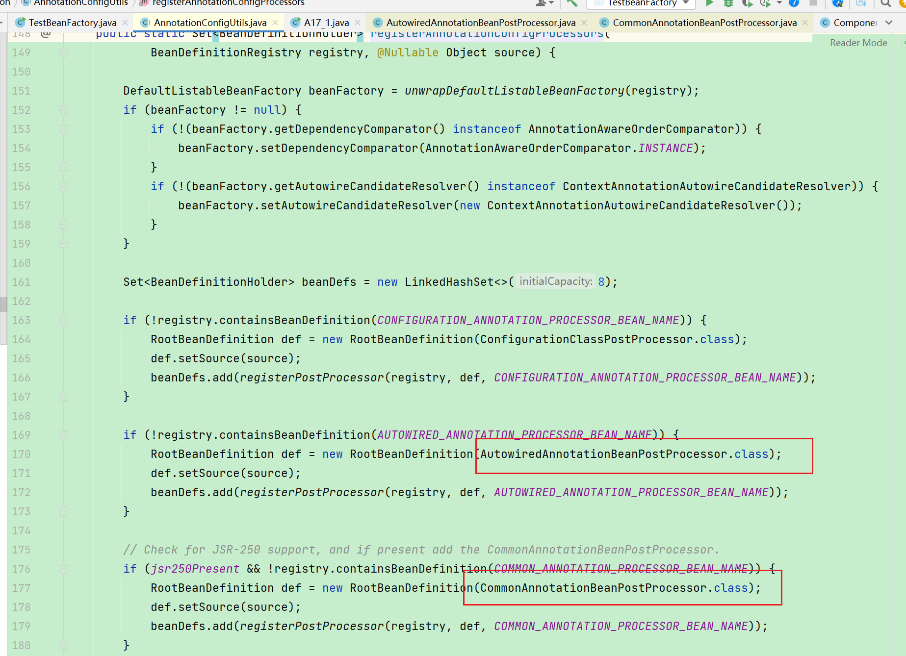
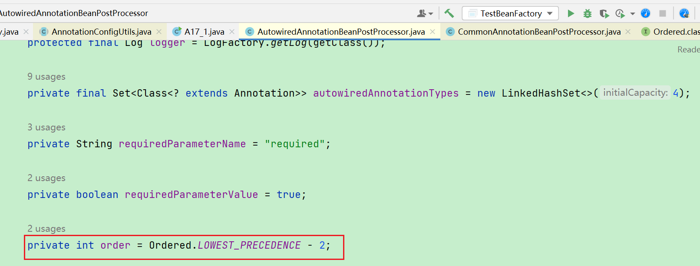

# BeanFactory的实现
其实beanFactory的实现类我们之前看到一个，他就是DefaultListableBeanFactory。
```java
DefaultListableBeanFactory beanFactory = new DefaultListableBeanFactory();
```
一开始创建里面没有任何的bean的。需要去添加一些bean的定义，而不是去添加一些bean对象。因为对象是beanFactory去创建的（控制反转）。
bean的定义就是描述你的beand的特征，比如类型（class）, 单例还是多例（scope）, 有没有初始化方法，销毁方法，是否懒加载等等。
下面通过编程方式去添加一个Bean的定义：
```java
@Configuration
static class Config {
    @Bean
    public Bean1 bean1() {
        return new Bean1();
    }

    @Bean
    public Bean2 bean2() {
        return new Bean2();
    }
}

```
```java

DefaultListableBeanFactory beanFactory = new DefaultListableBeanFactory();
// 构建一个beanDefinition
AbstractBeanDefinition beanDefinition =
                BeanDefinitionBuilder.genericBeanDefinition(Config.class).setScope("singleton").getBeanDefinition();
//注册beanDefinition
beanFactory.registerBeanDefinition("config", beanDefinition);
//打印查看是否添加成功
for (String name : beanFactory.getBeanDefinitionNames()) {
	System.out.println(name);
}


//输出：
config
```
运行上面结果只输出：config
那有同学可能会疑问，@Configuration配置类加了@Bean 为啥没注册进去 ? 
也就是@Configuration和@Bean并没有起到作用，说明beanFactory的功能不完整，需要添加一些常用的后处理器
```java
DefaultListableBeanFactory beanFactory = new DefaultListableBeanFactory();
AbstractBeanDefinition beanDefinition =
                BeanDefinitionBuilder.genericBeanDefinition(Config.class).setScope("singleton").getBeanDefinition();
beanFactory.registerBeanDefinition("config", beanDefinition);

 // 给 BeanFactory 添加一些常用的后处理器，对beanFactory进行扩展。
AnnotationConfigUtils.registerAnnotationConfigProcessors(beanFactory);

for (String name : beanFactory.getBeanDefinitionNames()) {
	System.out.println(name);
}

```
运行上面代码输出：
```java
输出：
config
//处理Configuration注解，以及里面的@Bean注解
org.springframework.context.annotation.internalConfigurationAnnotationProcessor
//解析@Autowired和@Value注解的
org.springframework.context.annotation.internalAutowiredAnnotationProcessor
//解析@Resource
org.springframework.context.annotation.internalCommonAnnotationProcessor
org.springframework.context.event.internalEventListenerProcessor
org.springframework.context.event.internalEventListenerFactory
```
以上代码只是添加了一些后置处理器，可以看到bean1和bean2还是没有的。我们需要执行这些后置处理器
```java
beanFactory.getBeansOfType(BeanFactoryPostProcessor.class).values().forEach(beanFactoryPostProcessor -> {
     beanFactoryPostProcessor.postProcessBeanFactory(beanFactory);
});
for (String name : beanFactory.getBeanDefinitionNames()) {
	System.out.println(name);
}
```
运行上面代码输出：可以看到bean1和bean2已经添加成功了。
```java
config
org.springframework.context.annotation.internalConfigurationAnnotationProcessor
org.springframework.context.annotation.internalAutowiredAnnotationProcessor
org.springframework.context.annotation.internalCommonAnnotationProcessor
org.springframework.context.event.internalEventListenerProcessor
org.springframework.context.event.internalEventListenerFactory
bean1
bean2
```
beanFactoryPostProcessor后面会讲，关键是要了解到Spring的beanFactory原始功并不丰富。他的扩展功能是由一些后置处理器来帮我们完成的。


由上面输出我们看到了bean1已经注入成功了。我们先看一下Bean1,Bean2的代码如下：

```java
static class Bean1 {
        private static final Logger log = LoggerFactory.getLogger(Bean1.class);

        public Bean1() {
            log.debug("构造 Bean1()");
        }

        @Autowired
        private Bean2 bean2;

        public Bean2 getBean2() {
            return bean2;
}
    
static class Bean2 {
        private static final Logger log = LoggerFactory.getLogger(Bean2.class);

        public Bean2() {
            log.debug("构造 Bean2()");
        }
}
```

Bean1里面通过注入了Bean2 @Autowired，我们来获取一下bean2。

```java
System.out.println(beanFactory.getBean(Bean1.class).getBean2());

输出：
[DEBUG] 20:39:45.755 [main] c.itheima.a02.TestBeanFactory$Bean1 - 构造 Bean1() 
null
```

可以看到获取的是null， @Autowired并没有生效。这里需要添加Bean的后置器处理器(org.springframework.beans.factory.annotation.AutowiredAnnotationBeanPostProcessor) 来处理@Autowire

```java
beanFactory.getBeansOfType(BeanPostProcessor.class).values().stream()
                .forEach(beanPostProcessor -> {
            System.out.println(">>>>" + beanPostProcessor);
            beanFactory.addBeanPostProcessor(beanPostProcessor);
        });
System.out.println(beanFactory.getBean(Bean1.class).getBean2());


输出：
>>>>org.springframework.context.annotation.CommonAnnotationBeanPostProcessor@5d0a1059
>>>>org.springframework.beans.factory.annotation.AutowiredAnnotationBeanPostProcessor@485966cc
[DEBUG] 22:11:24.955 [main] c.itheima.a02.TestBeanFactory$Bean1 - 构造 Bean1() 
[DEBUG] 22:11:24.967 [main] c.itheima.a02.TestBeanFactory$Bean2 - 构造 Bean2() 
com.itheima.a02.TestBeanFactory$Bean2@74ea2410

```

由上输出可以看成bean2添加成功。到这里可能有些小伙伴会有点疑问：前面不是调用过AnnotationConfigUtils.registerAnnotationConfigProcessors(beanFactory);添加了一次吗，这里怎么又调用 beanFactory.addBeanPostProcessor(beanPostProcessor)添加一次？

其实可以看成是添加bean的定义信息。后面添加的是后置处理器对象。


由于beanFactory是懒加载的，就是在获取bean的时候才去创建对象。由下面代码执行的结果可以看出：

```java
DefaultListableBeanFactory beanFactory = new DefaultListableBeanFactory();
// bean 的定义（class, scope, 初始化, 销毁）
AbstractBeanDefinition beanDefinition =            BeanDefinitionBuilder.genericBeanDefinition(Config.class).setScope("singleton").getBeanDefinition();
beanFactory.registerBeanDefinition("config", beanDefinition);

// 给 BeanFactory 添加一些常用的后处理器
AnnotationConfigUtils.registerAnnotationConfigProcessors(beanFactory);

// BeanFactory 后处理器主要功能，补充了一些 bean 定义
beanFactory.getBeansOfType(BeanFactoryPostProcessor.class).values().forEach(beanFactoryPostProcessor -> {
            beanFactoryPostProcessor.postProcessBeanFactory(beanFactory);
        });
for (String name : beanFactory.getBeanDefinitionNames()) {
            System.out.println(name);
}

 // Bean 后处理器, 针对 bean 的生命周期的各个阶段提供扩展, 例如 @Autowired @Resource ...
beanFactory.getBeansOfType(BeanPostProcessor.class).values()
                .forEach(beanPostProcessor -> {
            System.out.println(">>>>" + beanPostProcessor);
            beanFactory.addBeanPostProcessor(beanPostProcessor);
});

System.out.println(">>>>>>>>>>>>>>>>>>>>>>>>>>>>>>>>>>>>");
System.out.println(beanFactory.getBean(Bean1.class).getBean2());


输出：
config
org.springframework.context.annotation.internalConfigurationAnnotationProcessor
org.springframework.context.annotation.internalAutowiredAnnotationProcessor
org.springframework.context.annotation.internalCommonAnnotationProcessor
org.springframework.context.event.internalEventListenerProcessor
org.springframework.context.event.internalEventListenerFactory
bean1
bean2
>>>>org.springframework.beans.factory.annotation.AutowiredAnnotationBeanPostProcessor@6392827e
>>>>org.springframework.context.annotation.CommonAnnotationBeanPostProcessor@2ed2d9cb
[DEBUG] 22:41:38.067 [main] c.itheima.a02.TestBeanFactory$Bean1 - 构造 Bean1() 
[DEBUG] 22:41:38.075 [main] c.itheima.a02.TestBeanFactory$Bean2 - 构造 Bean2() 
>>>>>>>>>>>>>>>>>>>>>>>>>>>>>>>>>>>>
com.itheima.a02.TestBeanFactory$Bean2@15bb5034
```

可以看到在beanFactory.getBean(Bean1.class).getBean2()的时候才去执行了Bean的构造方法。这时候我们可以通过调用来预先准备好所有的单例。做到在获取bean之前，所有的单例bean已经提前准备好。

```java
beanFactory.preInstantiateSingletons(); 
```


**这里我们做一个小总结：**

1. beanFactory 不会做的事
   1.  不会主动调用 BeanFactory 后处理器
   2. 不会主动添加 Bean 后处理器
   3.  不会主动初始化单例
   4. 不会解析beanFactory 还不会解析 ${ } 与 #{ }

也就是说beanFactory是一个基础容器，很多扩展功能都没有，需要手动处理。下面讲的ApplicaionContext就会自动把这些事情先工作都给你做好，我们直接使用即可。所以我们更推荐使用ApplicaionContext。

# 后处理器排序

前面我们提到Bean的处理器是有多个的，有些处理@Autowired，有些处理@Resource，我们通过AnnotationConfigUtils.registerAnnotationConfigProcessors(beanFactory);点进去查看一下源码。可以看到添加了相关的Bean后置处理器。



现在提出一个问题：我在属性上既加了@Autowired，又加了@Resource到底哪个生效？这里我们来做一个实验。有如下先写好的类。

```java
@Configuration
static class Config {
        @Bean
        public Bean1 bean1() {
            return new Bean1();
        }

        @Bean
        public Bean2 bean2() {
            return new Bean2();
        }

        @Bean
        public Bean3 bean3() {
            return new Bean3();
        }

        @Bean
        public Bean4 bean4() {
            return new Bean4();
        }
}

static class Bean2 {
        private static final Logger log = LoggerFactory.getLogger(Bean2.class);

        public Bean2() {
            log.debug("构造 Bean2()");
        }
    }

interface Inter {

}

static class Bean3 implements Inter {

}

static class Bean4 implements Inter {

}
static class Bean1 {
        private static final Logger log = LoggerFactory.getLogger(Bean1.class);

        public Bean1() {
            log.debug("构造 Bean1()");
        }

        @Autowired
        private Bean2 bean2;

        public Bean2 getBean2() {
            return bean2;
        }
}
```

对于Bean1，我进行如下改动，添加以下代码。

```java
@Autowired
private Inter inter;

public Inter getInter() {
    return inter;
}
```

运行的时候我们会发现报 **No qualifying bean of type 'com.itheima.a02.TestBeanFactory$Inter' available** 的错误。

因为对于接口类型Inter有两个实现类。@Autowired不知道要加载哪个类。为了让它不报错我们可以对以上代码进行稍微改动。

比如我们可以用@Qualify来指定。还可以直接改成员变量名字：

```java
@Autowired
private Inter bean3;

public Inter getInter() {
  return bean3;
}
```

这里@Autowired有一个规则：如果发现同类型的bean有多个，那就会把成员变量の名字和bean的名字做一个匹配。如果匹配上了就优先选择该bean。

我们输出一下来进行验证是否注入的是bean3:

```java
System.out.println(beanFactory.getBean(Bean1.class).getInter());

输出：
com.itheima.a02.TestBeanFactory$Bean3@25ce9dc4
```

对于@Resource如果不指定name属性也会通过成员变量的名字去找，如果指定name属性，那就通过name的值去找bean

```
@Resource
private Inter bean3;

public Inter getInter() {
  return bean3;
}
```

现在我们同时添加两个注解，然后运行看看，到底是谁生效。

```java
@Autowired
@Resource(name = "bean4")
private Inter bean3;

public Inter getInter() {
   return bean3;
}
```

运行代码发现注入的是Bean3。

```java
System.out.println(beanFactory.getBean(Bean1.class).getInter());

输出：
com.itheima.a02.TestBeanFactory$Bean3@25ce9dc4
```

这里其实就和添加Bean的后置处理器的顺序有关。先加的后置处理器一般优先级高，就先进行处理。在**AnnotationConfigUtils.registerAnnotationConfigProcessors(beanFactory)**的源码中也确实**AutowiredAnnotationBeanPostProcessor**先添加的。

那这个顺序可以控制吗？答案是肯定的。我们可以通过一些比较器来控制先后。

```java
 beanFactory.getBeansOfType(BeanPostProcessor.class).values().stream()
                .sorted(beanFactory.getDependencyComparator())
                .forEach(beanPostProcessor -> {
            System.out.println(">>>>" + beanPostProcessor);
            beanFactory.addBeanPostProcessor(beanPostProcessor);
});

System.out.println(beanFactory.getBean(Bean1.class).getInter());
```

我们通过beanFactory.getDependencyComparator()加入了一个比较器来控制先后。这时候我们输出可以看到CommonAnnotationBeanPostProcessor在前面，而且注入的是Bean4

```
>>>>org.springframework.context.annotation.CommonAnnotationBeanPostProcessor@5d0a1059
>>>>org.springframework.beans.factory.annotation.AutowiredAnnotationBeanPostProcessor@485966cc
com.itheima.a02.TestBeanFactory$Bean4@2034b64c
```

那么beanFactory.getDependencyComparator()这个比较器是哪里来的呢？

我们进去AnnotationConfigUtils.registerAnnotationConfigProcessors(beanFactory)的源码可以看到。


比较器有了，那是根据什么去排序的呢？

其实就是去通过后置处理中的getOrder()方法返回优先级，数字小的排在前面。

我们查看CommonAnnotationBeanPostProcessor的源码发现构造器中有如下代码


再查看AutowiredAnnotationBeanPostProcessor的源码



数字越小的，优先级越高 , 所以通过beanFactory.getDependencyComparator()加入比较器后。CommonAnnotationBeanPostProcessor的优先级高。所以优先注入Bean4。

**总结一点就是：bean的后置处理器有排序的逻辑**
