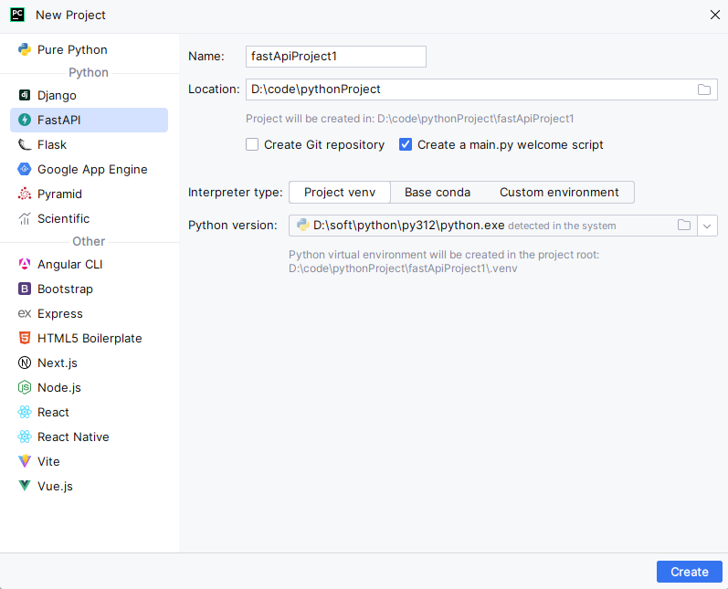
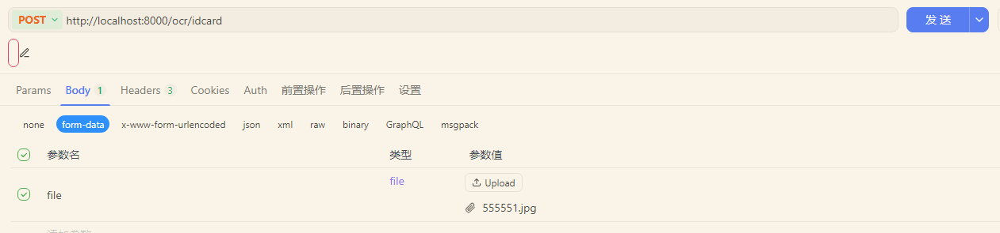

# 1. 环境构建
## 1.1 新建fastapi项目
利用PyCharm新建一个FastAPI项目
<!-- 这是一张图片，ocr 内容为： -->


## 1.2 添加额外需要的依赖
创建好项目后添加一些其他的依赖
**1）图片识别需要：**

> pip install paddlepaddle
> pip install paddleocr


**2）上传图片需要：**

> pip install python-multipart

## 1.3 项目环境
利用 pip list 查看相关的依赖版本

```bash
Package               Version
--------------------- -----------
aistudio-sdk          0.3.8
annotated-doc         0.0.4
annotated-types       0.7.0
anyio                 4.12.1
bce-python-sdk        0.9.59
certifi               2026.1.4
chardet               5.2.0
charset-normalizer    3.4.4
click                 8.3.1
colorama              0.4.6
colorlog              6.10.1
fastapi               0.128.0
filelock              3.20.2
fsspec                2025.12.0
future                1.0.0
h11                   0.16.0
hf-xet                1.2.0
httpcore              1.0.9
httptools             0.7.1
httpx                 0.28.1
huggingface_hub       1.2.4
idna                  3.11
imagesize             1.4.1
modelscope            1.33.0
networkx              3.6.1
numpy                 2.4.0
opencv-contrib-python 4.10.0.84
opt-einsum            3.3.0
packaging             25.0
paddleocr             3.3.2
paddlepaddle          3.2.2
paddlex               3.3.12
pandas                2.3.3
pillow                12.1.0
pip                   23.2.1
prettytable           3.17.0
protobuf              6.33.2
psutil                7.2.1
py-cpuinfo            9.0.0
pyclipper             1.4.0
pycryptodome          3.23.0
pydantic              2.12.5
pydantic_core         2.41.5
pypdfium2             5.3.0
python-bidi           0.6.7
python-dateutil       2.9.0.post0
python-dotenv         1.2.1
python-multipart      0.0.21
pytz                  2025.2
PyYAML                6.0.2
requests              2.32.5
ruamel.yaml           0.19.1
safetensors           0.7.0
setuptools            80.9.0
shapely               2.1.2
shellingham           1.5.4
six                   1.17.0
starlette             0.50.0
tqdm                  4.67.1
typer-slim            0.21.1
typing_extensions     4.15.0
typing-inspection     0.4.2
tzdata                2025.3
ujson                 5.11.0
urllib3               2.6.3
uvicorn               0.40.0
watchfiles            1.1.1
wcwidth               0.2.14
websockets            15.0.1

```

# 2. 代码实现
```python
from fastapi import FastAPI, UploadFile, File
from paddleocr import PaddleOCR
import uuid
import os
import re

app = FastAPI()

# 建议：OCR 实例全局初始化
ocr = PaddleOCR(lang='ch')
# 存放图片的文件夹
UPLOAD_DIR = "temp_images"
os.makedirs(UPLOAD_DIR, exist_ok=True)


@app.get("/")
async def root():
    return {"message": "Hello World"}


@app.post("/ocr/idcard")
async def ocr_idcard(file: UploadFile = File(...)):
    """
    接收身份证图片并进行OCR识别，有一定的识别失败率。
    """
    # 1. 保存上传的图片
    suffix = os.path.splitext(file.filename)[-1]
    temp_filename = f"{uuid.uuid4()}{suffix}"
    temp_path = os.path.join(UPLOAD_DIR, temp_filename)

    with open(temp_path, "wb") as f:
        f.write(await file.read())
    try:
        # OCR识别
        ocr_result = ocr.predict(temp_path)
        data = ocr_result[0]
        # 对于不同版本的paddleocr可能存在识别出来的数据不一样。
        texts = data.get("rec_texts", [])

        # 解析身份证
        idcard = parse_idcard(texts)

        id_number = idcard.get("id_number")

        # 判断身份证是否合法
        if not id_number or not is_valid_id_number(id_number):
            return {
                "success": False,
                "message": "图片有误，请重新上传身份证照片"
            }

        return {
            "success": True,
            "message": "成功",
            "texts": texts,
            "result": idcard
        }

    finally:
        # 最后删除临时文件夹的图片，看需求决定是否保留
        if os.path.exists(temp_path):
            os.remove(temp_path)


def parse_idcard(texts: list[str]):
    """
    从OCR文本中解析出身份证和姓名等信息
    """
    result = {
        "name": None,
        "gender": None,
        "birthday": None,
        "address": None,
        "id_number": None
    }

    i = 0
    address_lines = []

    while i < len(texts):
        text = texts[i].replace(" ", "").strip()
        if text.startswith("姓名"):
            value = text.replace("姓名", "")
            if value:
                result["name"] = value
            else:
                # 下一行是姓名
                if i + 1 < len(texts):
                    result["name"] = texts[i + 1].strip()
        elif text.startswith("性别"):
            value = text.replace("性别", "")
            if value:
                result["gender"] = value[0]
            else:
                if i + 1 < len(texts):
                    result["gender"] = texts[i + 1].strip()
        elif text.startswith("出生"):
            value = text.replace("出生", "")
            if value:
                result["birthday"] = value
            else:
                if i + 1 < len(texts):
                    result["birthday"] = texts[i + 1].strip()

        # 住址（可能多行）
        elif text.startswith("住址"):
            value = text.replace("住址", "")
            if value:
                address_lines.append(value)

            # 向后继续收集，直到遇到“公民身份号码”
            j = i + 1
            while j < len(texts):
                next_text = texts[j].replace(" ", "").strip()
                if "公民身份号码" in next_text:
                    break
                address_lines.append(texts[j].strip())
                j += 1

            result["address"] = "".join(address_lines)
        # 身份证号（优先关键字，其次正则）
        elif "公民身份号码" in text:
            value = text.replace("公民身份号码", "")
            if value:
                result["id_number"] = value
            else:
                if i + 1 < len(texts):
                    result["id_number"] = texts[i + 1].strip()

        # 防止 OCR 把关键字漏了
        else:
            m = re.search(r"\d{17}[\dXx]", text)
            if m:
                result["id_number"] = m.group()
        i += 1
    return result


def is_valid_id_number(id_number: str) -> bool:
    """
    简单判断是否为18位身份证号
    """
    if not id_number:
        return False

    id_number = id_number.upper().replace(" ", "")

    # 17位数字 + 1位数字或X
    return bool(re.fullmatch(r"\d{17}[\dX]", id_number))


```

# 3. 测试接口
启动项目后利用接口调用工具测试一下接口，这里使用的是apifox

<!-- 这是一张图片，ocr 内容为： -->


最终输出结果如下：

```json
{
  "success": true,
  "message": "成功",
  "texts": [
    "姓名xx",
    "性别xx",
    "民族xx",
    "出生xxx",
    "住址xxxx",
    "xxx",
    "xx",
    "61xxxx"
  ],
  "result": {
    "name": "xxx",
    "gender": "xx",
    "birthday": "xx",
    "address": "xxxx",
    "id_number": "xxxxxxxxx"
  }
}
```

# 4.更多信息
关于更多的信息请查看框架的官网：

fastapi ：  [https://fastapi.tiangolo.com/](https://fastapi.tiangolo.com/)

pp飞桨：[https://www.paddlepaddle.org.cn/](https://www.paddlepaddle.org.cn/)

PaddleOCR： [https://github.com/PaddlePaddle/PaddleOCR](https://github.com/PaddlePaddle/PaddleOCR)


