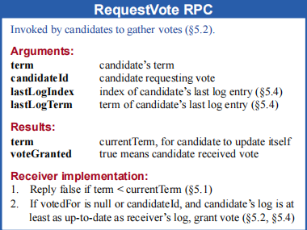
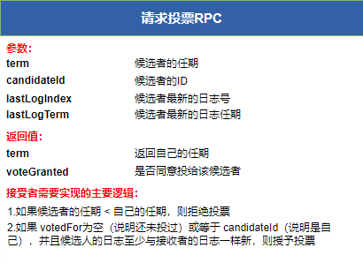
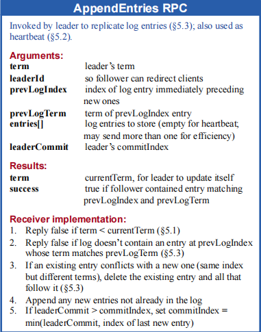
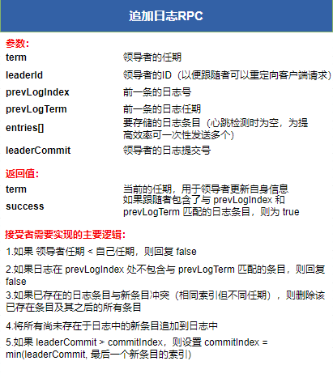

# 一、什么是Raft
Raft是一种分布式共识算法，也称为一致性算法：其核心目标是让多台计算机（节点）能够在某些事务上达成一致，并作为一个单一、可靠的系统对外提供服务。常见的分布式共识算法包括Paxos、Raft、ZAB协议等。当然，本文的主角是Raft。

# 二、复制状态机
在继续学习Raft之前，我们需要了解一下 **复制状态机（Replicated state machine）** 这个概念。简单一句话来讲就是：相同的初始状态 + 相同的输入 = 相同的终态。

比如这里有三条日志：

> 1. set x=1
> 2. set y=2
> 3. set z=x+y

把这3条日志放到多台计算上按照顺序执行之后，得到的最终结果是一样的。这也是Raft通过复制日志来保证一致性的原理。

下面简述一下在Raft中怎么体现这个流程：

1. 在Raft中有1个主节点（leader）和多个从节点（follower）。

2. 主节点接收客户端（client）的请求（command），把请求封装成日志对象（log entry）。

3. 主节点同步这些日志对象（log entry）到从节点。

4. 所有节点按照顺序执行这些日志，就能保证执行完成后集群节点的状态都是一致的。

# 三、Raft基础概念

## 主节点选举

Raft协议是主从架构模式。需要通过投票机制来选出主节点（leader）。主节点选举细节在下方说明。

## 任期

在 Raft 协议中，Term（任期） 是一个全局单调递增的整数，它就像游戏里面的“赛季”，表示当前是第几个“赛季”。谁的“赛季”越大，就代表消息越新，权力越大。

每发生一次新的领导者选举，任期号就加 1。集群中的每个节点都会维护自己的Term，并在节点间通信时携带该值。

## 节点的三种状态

在 Raft 中，集群里的每个节点都会处在三种状态之一：**领导者（leader）**、**候选者（candidate）** 和 **跟随者（follower）**。这三种状态会在某些条件下进行相互转换。

### 1. 跟随者（follower）

这是节点的默认状态。大多数时间里，节点都只是安静地当跟随者，接收 Leader 发来的指令（AppendEntries RPC），并按要求执行。

只要跟随者能持续收到 Leader 的心跳，它就不会主动做任何事情。

### 2. 候选者（candidate）

当跟随者在一段时间内没有收到 Leader 的消息，就会认为 Leader 可能已经失效。

这时，节点会：

1. 把自己切换成候选者，候选者的目标只有一个，当选为新的 Leader

2. 增加自己的任期号（Term）

3. 向其他节点发起投票请求（RequestVote）

### 3. 领导者（leader）

   当候选者获得集群中超过半数节点的投票后，就会成为 Leader。主要负责：

   - 接收客户端请求
   - 复制日志到各个跟随者
   - 定期发送心跳，维持自己的领导地位

## 集群节点通信

集群中的节点采用远程过程调用（RPC）进行通信，主要有两种RPC类型。

**RequestVote RPC（请求投票）**：在选举过程中，候选节点会向集群中其他节点发送投票请求，意思很直白：“这一轮，能不能选我当 Leader？”

**AppendEntries RPC（追加日志 / 心跳）：** 由 Leader 发起，主要用途有两个：

- **日志复制**：把新的日志条目发送给 Follower
- **心跳检测**：即使没有新日志产生，也会定期发送心跳，用来告诉大家：“我还活着，Leader 还是我”

对于一个RequestVote RPC（请求投票）包含的信息如下图：

对于一个AppendEntries RPC（追加日志 / 心跳）包含的信息如下图：

# 四、Leader选举

在系统刚启动的时候，所有节点都是Follower状态。Follower发现一段时间后并没有接受到Leader节点发来的心跳。就会认为集群中没有Leader。

Follower在随机一段时间后发起选举，候选人在选举中获胜的条件是：在完整集群中获得半数以上服务器的投票支持，每个服务器在任一任期最多只能为一名候选人投票，采用先到先得原则。

主要做的操作如下：

1. Follower增加自己的当前任期号，并且转变成Candidate状态
2. 先给自己投一票
3. 并行的给其他节点发送RequestVote RPC（请求投票）
4. 其他节点收到投票请求之后判断是否要投这一票（上面RequestVote RPC（请求投票）的图片中包含了该逻辑）
   1. 如果请求中的任期<自己的任期，那就直接拒绝啦
   1. 如果 votedFor为空（说明还未投过）或者已经投给了这个candidate（处理重复请求），并且候选人的日志至少与接收者的日志一样新，则授予投票

候选者（candidate）将保持当前状态，直至以下三种情况之一发生：

- 自己获得半数以上选票赢得了选举，由候选者（candidate）转变成领导者（leader），开始给其他节点发送心跳。

- 其他节点成为了Leader

  - 自己收到了其他节点的AppendEntries RPC请求。
  - 新Leader的任期号>=自己的任期号，那自己就切换为Follower状态。

- 一段时间后没有任何候选者（candidate）获胜，则每个候选者（candidate）会在一段随机时间后，增加任期号继续发起新一轮的投票。

  - 因为可能出现票数过于分散的情况。没有任何一个节点的票数达到了大多数。这种情况就继续选举。
  
  - 在极端情况下，这种选票分散现象可能无限循环（基本不可能出现），需要实现的协议的应用来做额外措施
  
    
  
# 五、节点间的状态转换

熟悉完领导选举过程。我们现在再来看看节点的三种状态是如果进行转换的。我们可以按照图中的箭头路径来理解这个动态过程：

### 从 Follower 到 Candidate（选举开始）

- **触发条件**：Follower 在设定的时间内没有收到 Leader 的心跳（即 **times out**）。
- **动作**：节点增加自己的“任期号”（Term），转换为 Candidate 状态，并向其他节点请求投票（箭头2）。

### Candidate 的三种结局

3. **赢得选举**：收到集群中大多数节点的选票转换为 Leader（箭头3）。
4. **选举失败**：在等待投票期间，发现已经有别的节点当选了 Leader（收到了新 Leader 的心跳）或发现了更高的任期号 ， 退回 Follower（箭头4）。
5. **无人胜出**：如果选票被瓜分，没有人拿到过半票以上的票， 再次 times out，重新开始一轮新选举（箭头5）。

###  从 Leader 到 Follower（退位）

- 触发条件：Leader 发现集群中出现了更高的任期号（例如网络分区恢复后，遇到了一个任期更新、序号更大的节点）。
- 动作：Leader 意识到自己“过时”了，立即降级为 Follower，以维持集群的一致性（箭头6）。

# 六、日志复制

在Raft中，日志(logs)由多个条目(entry)组成，条目(entry)按顺序编号。每个条目(entry)包含其创建时的任期号(term)（每个方框中的数字）以及状态机的指令。

如果某个条目(entry)可以安全地应用到状态机上，则该日志条目被视为已提交(*committed*)。

## 日志提交

在 Raft 中，日志的处理遵循一个两阶段流程：**先复制，后提交**。

1. 提交（Committed）的定义

   在 Raft 中，一条日志条目被视为“已提交”，必须满足以下条件：

   - 多数派确认：当前的 Leader 已经将该日志条目复制到了集群中超过半数（Majority）的服务器上。
   - Leader 操作：Leader 会跟踪已知的最大已提交索引commitIndex，并在后续的 AppendEntries RPC（心跳或日志复制请求）中通知所有 Follower。

2. 为什么增加要“提交”这个机制？

   引入提交机制主要是为了保证以下两点：

   - **数据持久性与一致性**：在 Raft 中，一旦日志被标记为“已提交”，就意味着该日志已经被多数节点持久化并形成共识。即使当前 Leader 宕机，新选出的 Leader 也一定包含所有已提交的日志。这一安全性保证由 RequestVote RPC 中的日志完整性比较规则所确保（后文将说明）。
- **防止指令回滚**：如果没有“提交”这一阶段，Follower 可能会在接收到 Leader 的日志后立即将其应用到状态机。然而，一旦 Leader 在日志尚未形成共识前宕机，新选出的 Leader 由于没有收到过这一条日志，就会让其他节点和自己保持一致，从而导致已经执行过的指令被回滚，破坏系统一致性。

## 日志复制

下面简述一下日志复制的流程：

1. **接收请求**：Leader 接收到客户端发来的指令（command）。

2. **2. 本地写入**：Leader 将指令封装成一个日志条目（log entry），并将其追加到自己的本地日志中。

3. **并行复制**：Leader 通过 AppendEntries RPC 将该日志条目并行地发送给集群中所有的 Follower。

4. **确认响应**：Follower 接收并记录日志（但不立即执行），成功后向 Leader 返回确认信号。

5. **计算过半：** Leader 跟踪记录该日志已被同步到了哪些节点。一旦确认该日志已经存储在大多数节点上（包括 Leader 自己），该日志即进入已提交（committed）状态。

6. **执行指令**：Leader 将该日志条目应用（Apply）到自己的状态机中执行，并向客户端返回处理结果。

7. **通知提交**：Leader 在后续与 Follower 的心跳或通信中，会告知当前的 commitIndex。Follower 获知后，也会将该日志条目应用到各自的本地状态机中，确保全集群状态一致。

**这里我们再讨论一下如何接受客户端的请求：**

1. 如果客户端给Follower发送请求 或者说 初始的Leader挂了，集群重新选出来一个Leader。客户端怎么知道Leader在哪里。在论文里面并没有明确指出，因为这是实现层的事，常见有三种模式。
   1. 如果客户端目前连接的就是Leader，直接执行操作即可
   2. 如果客户端连接的是Follower
      1. Follower可以告诉客户端Leader在哪里，客户端再去请求Leader
      2. Follower转发请求给Leader处理
   3. 只读请求由 Follower 处理

## Leader崩溃后的情况

正常情况下，对于一个Append Entries RPC请求，如果跟随者（follower）一直返回true说明岁月静好。领导者（Leader）和跟随者（follower）的总能保持同步。对于那些复制的慢跟随者（follower），领导者（Leader）可以让他们尽快追上来。然而，Leader崩溃后的情况会使得日志处于不一致的状态。

下面看一下可能会出现的情况：

当新的 Leader 成功当选后，集群中的各个 Follower 可能处于不同的日志状态。图中的每一个方块代表一条日志记录，方块内的数字表示该日志所属的任期（term）。

由于节点在运行过程中可能发生宕机、网络隔离等异常，Follower 的日志并不一定与 Leader 完全一致，主要可能出现以下几种情况：

- 有的 Follower **缺少部分日志条目**（a-b）；
- 有的 Follower **包含一些尚未提交的日志条目**(c-d)；
- 也可能同时存在上述两种情况(e-f)。

**场景C:** 例如，在场景c中，Follower 前面的日志完全和 Leader 一致但是 Follower 多了一些后续日志。这些“多出来的日志”，是 Follower 曾经跟随 旧 Leader 写入的，在当前 term=8 的 leader 看来，是 未提交、不可信的。

**场景F：** 例如，场景 f 可能会这样发生，某服务器在任期 2 的时候是领导人，已附加了一些日志条目到自己的日志中，但在提交之前就崩溃了；很快这个机器就被重启了，在任期 3 重新被选为领导人，并且又增加了一些日志条目到自己的日志中；在任期 2 和任期 3 的日志被提交之前，这个服务器又宕机了，并且在接下来的几个任期里一直处于宕机状态。

对于这种日志处于不一致的状态。Raft定义了一个一致性检查的规则。

## 一致性检查

Raft会通过一致性检查来解决不一致的情况，**Raft 的一致性检查机制**是这样的：

1. Leader 在向 Follower 发送 AppendEntries RPC 时，会同时携带**前一条日志的索引（prevLogIndex）和任期号（prevLogTerm）**，用来确认双方日志是否在这一位置上保持一致。

2. Follower 在收到请求后，会检查自己本地日志中是否存在对应索引、且任期号一致的日志条目。如果找不到，说明两者的日志已经出现分叉，Follower 会拒绝这次追加请求。

3. Leader 在收到拒绝响应后，并不会放弃，而是**回退到更早的一条日志位置**，重新发送 Append Entries请求。
    通过不断回退和重试，Leader 最终能够定位到 Follower 日志中**最后一个与自己一致的位置**，并从那里开始，将缺失或冲突的日志重新同步过去。

**这里有两个问题说明一下：**

1. 通过不断回退检查上一条日志，这样效率不是很低？

   Raft认为失败是很少发生的并且也不大可能会有这么多不一致的日志。而且也做了相关测试，如果实现层想自己优化，当然可以。

2. Leader 最终能够定位到 Follower 日志中最后一个与自己一致的位置，并从那里开始复制，这可能会覆盖Follower 的一些日志？

   这是Raft的设计，必须以Leader为主，因为这是集群的最新共识。

在 Raft 的世界里，Leader 拥有绝对的真理权。一致性检查不是为了商量，而是为了让 Follower 最终对齐Leader 的步调

# 七、安全性

在上面描述了 Raft 算法是如何选举和复制日志的。然而，截至目前描述的机制还不足以确保每个状态机以完全相同的顺序执行完全相同的命令。所以Raft协议增加一些限制来完善算法。

## 选举限制

例如，一个跟随者可能会进入不可用状态同时领导人已经提交了若干的日志条目，随后它可能被选为领导者并用新的条目覆盖这些已提交的日志条目。这里有一个比较严重的问题就是会导致已经提交的日志被覆盖了。

所以Raft需要对领导者（leader）选举做出一些限制，保证这个选出来的领导者（leader）一定包含了所有已经提交的日志条目。

当一个候选人请求投票时（RequestVote RPC），他会带上两样信息：

- 自己**最后一条日志的任期号**
- 自己**日志的长度（索引）**

收到这个请求的服务器做如下判断：

1.  先看最后一条日志的任期号，任期号大的 → 日志更新
2. 如果任期号一样，日志更长的 → 日志更新

### 为什么这样一定能保证 Leader 日志最全？

因为：

- 要当 Leader，必须拿到多数派的票
- 而每一条已经提交的日志至少存在于多数派中的某个节点
- 如果候选人的日志不包含这些内容，就一定会被其中某些节点拒绝投票

 结果就是：**没拿全历史记录的人，永远凑不齐多数票。**

## 提交之前任期内的日志条目

### 1. 当前任期的日志条目提交

当 Leader 发现某个日志条目属于它当前的任期，并且已经被 大多数服务器 存储时，它就可以 确定该条目已经提交。
 这意味着，Leader 可以安全地通知所有副本应用这个条目，从而保证状态机的一致性。

### 2. Leader 崩溃与日志复制

如果在提交条目之前，Leader 突然崩溃，那么后续新当选的 Leader 会尝试继续复制这些条目。
 也就是说，即便日志条目尚未被正式提交，Raft 也能保证它最终会被复制并提交，从而不会丢失数据。

### 3. 旧任期的日志条目不能直接提交

对于 先前任期 的日志条目，即使它已经被存储在 大多数服务器上，新 Leader 也不能立即认为它已提交。

### 4. 利用当前任期日志间接提交旧条目

不过不用担心，旧日志不会被忽略。一旦 **当前任期的某条日志条目被提交**，Raft 利用日志的一致性检查，进行同步日志。然后**间接地提交之前的所有条目**。
 也就是说，旧条目最终还是会被提交，只是通过当前任期的条目提交来触发。

### 5. Raft 的保守策略

Leader 实际上是可以安全判断旧日志条目已提交的，例如：旧条目已经存储在 所有服务器 上。但是，为了简化实现和保证安全性，Raft 只是采取了更加保守的策略。

## Raft 中跟随者和候选者崩溃处理

到目前为止，我们主要关注了 Leader 故障 的处理机制。但其实，在 Raft 中，跟随者（Follower）和候选者（Candidate）的崩溃处理要简单得多，而且两者的处理方式几乎相同。

### 1. 跟随者或候选者崩溃会发生什么？

当一个跟随者或候选者崩溃时，集群中其他服务器 发送给它的 RPC 请求（RequestVote 或 AppendEntries）会失败。

由于目标服务器宕机，这些请求暂时无法完成。

### 2. Raft 如何保证故障恢复？

Raft 使用 无限重试机制 来处理这种情况：

1. 当崩溃的服务器 重启后，它会再次收到之前未完成的 RPC 请求。
2. 如果服务器在完成 RPC 但在发送响应之前崩溃，它在重启后也会重新接收相同的 RPC。

关键点就是：**Raft 的 RPC 是幂等的**。

## 时间和可用性

在 Raft 一致性算法中，时间的作用分为 **安全性** 和 **可用性** 两个方面

### 1. 安全性不能依赖时间

Raft 的核心要求之一是：系统的安全性不能依赖于时间。也就是说，无论消息传输速度比预期快一点还是慢一点，系统都 不应该产生错误的结果。

### 2. 可用性不可避免依赖时间

然而，可用性（系统能及时响应客户端）是 **不可避免依赖时间的**。

原因在于：

- 如果消息传递比服务器故障间隔时间长，候选人可能 **没有足够时间赢得选举**。
- 没有稳定的领导人，Raft **无法工作**。

所以，Raft 对时间要求的最关键环节就是 **领导人选举**。

###  3. 选举稳定性的时间要求

Raft 保证能选举并维持一个稳定领导人的前提是：

> 广播时间 (broadcastTime) << 选举超时时间 (electionTimeout) << 平均故障间隔时间 (MTBF)

**广播时间 (broadcastTime)**

- 一个服务器并行发送 RPC 给集群中其他服务器并接收响应的平均时间。
- 包含网络传输和稳定存储写入的时间，一般在 **0.5ms ~ 20ms** 之间。

**选举超时时间 (electionTimeout)**

- 如果跟随者在这段时间内没有收到心跳，它会发起选举。
- 我们可以自己选择，一般在 **10ms ~ 500ms**。

**平均故障间隔时间 (MTBF)**

- 对于一台服务器，两次故障之间的平均时间。
- 大多数服务器的 MTBF 在 **几个月甚至更长**，很容易满足这个要求。

### 4. 时间不等式的重要性

1. **广播时间 << 选举超时时间**
   - 领导人能够及时发送心跳，防止跟随者提前发起选举。
   - 通过 **随机化选举超时时间**，减少选票平分的可能性。
2. **选举超时时间 << 平均故障间隔时间**
   - 系统稳定运行，大部分时间有稳定的领导人。
   - 当领导人崩溃时，整个系统大约不可用 **一个选举超时的时间**。
   - 由于领导人崩溃相对少见，系统可用性总体影响很小。

 # 八、参考

参考文档：https://raft.github.io/

参考视频：https://www.bilibili.com/video/BV1pr4y1b7H5

