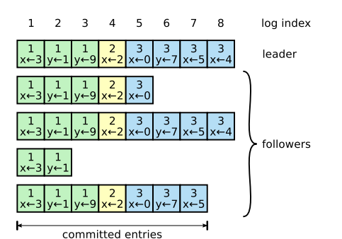
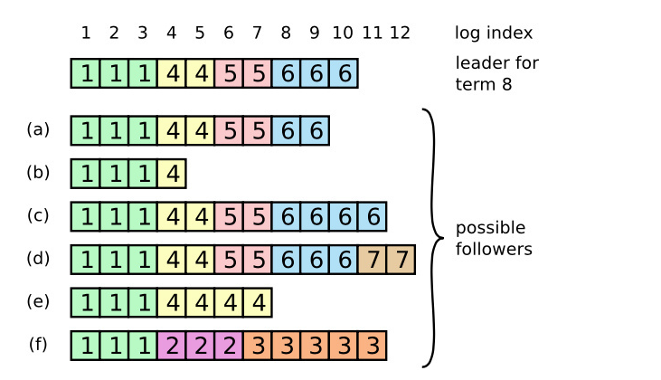

# 一、什么是Raft
Raft是一种分布式共识算法，也称为一致性算法：其核心目标是让多台计算机（节点）能够在某些事务上达成一致，并作为一个单一、可靠的系统对外提供服务。常见的分布式共识算法包括Paxos、Raft、ZAB协议等。当然，本文的主角是Raft。

# 二、复制状态机
在继续学习Raft之前，我们需要了解一下 **复制状态机（Replicated state machine）** 这个概念。简单一句话来讲就是：相同的初始状态 + 相同的输入 = 相同的终态。
比如这里有三条日志：

1. set x=1
2. set y=2
3. set z=x+y

把这3条日志放到多台计算上按照顺序执行之后，得到的最终结果是一样的。这也是Raft通过复制日志来保证一致性的原理。

下面简述一下在Raft中怎么体现这个流程：

1. 在Raft中有1个主节点（leader）和多个从节点（follower）。

2. 主节点接收客户端（client）的请求（command），把请求封装成日志对象（log entry）。

3. 主节点同步这些日志对象（log entry）到从节点。

4. 所有节点按照顺序执行这些日志，就能保证执行完成后集群节点的状态都是一致的。

# 三、Raft基础概念

## 主节点选举

Raft协议是主从架构模式。需要通过投票机制来选出主节点（Leader）。主节点选举细节在下方说明。

## 集群节点通信

集群中的节点采用远程过程调用（RPC）进行通信，主要有两种RPC类型。

**RequestVote RPC（请求投票）**：在选举过程中，候选节点会向集群中其他节点发送投票请求，意思很直白：“这一轮，能不能选我当 Leader？”

**AppendEntries RPC（追加日志 / 心跳）：**由 Leader 发起，用途有两个：

- **日志复制**：把新的日志条目发送给 Follower
- **心跳检测**：即使没有新日志产生，也会定期发送心跳，用来告诉大家：“我还活着，Leader 还是我”

对于一个RequestVote RPC（请求投票）包含的信息如下图：

对于一个AppendEntries RPC（追加日志 / 心跳）包含的信息如下图：

## 任期

在 Raft 协议中，Term（任期） 是一个全局单调递增的整数，它就像游戏里面的“赛季”，表示当前是第几个“赛季”。谁的“赛季”越大，就代表消息越新，权力越大。

每发生一次新的领导者选举，任期号就加 1。集群中的每个节点都会维护自己的Term，并在节点间通信时携带该值。

## 节点的三种状态

在 Raft 中，集群里的每个节点都会处在三种状态之一：**领导者（Leader）**、**候选者（Candidate）** 和 **跟随者（Follower）**。这三种状态会在某些条件下进行相互转换。

### 跟随者（Follower）

这是节点的**默认状态**。大多数时间里，节点都只是安静地当跟随者，接收 Leader 发来的指令（AppendEntries RPC），并按要求执行。

只要跟随者**能持续收到 Leader 的心跳**，它就不会主动做任何事情。

### 候选者（candidate）

当跟随者在一段时间内没有收到 Leader 的消息，就会认为 Leader 可能已经失效。

这时，节点会：

1. 把自己切换成候选者，候选者的目标只有一个，当选为新的 Leader

2. 增加任期号（Term）

3. 向其他节点发起投票请求（RequestVote）

### 领导者（Leader）

   当候选者获得**集群中超过半数节点的投票**后，就会成为 Leader。主要负责：

   - 接收客户端请求
   - 复制日志到各个跟随者
   - 定期发送心跳，维持自己的领导地位

# Leader选举

在系统刚启动的时候，所有节点都是follower状态。follower发现一段时间后并没有接受到leader节点发来的心跳。就会认为集群中没有leader。

follower在随机一段时间后发起选举，候选人在选举中获胜的条件是：在完整集群中获得多数服务器的投票支持。每个服务器在任一任期最多只能为一名候选人投票，采用先到先得原则。

主要做的操作如下：

1. follower增加自己的当前任期号，并且转变成候选者（candidate）状态
2. 先给自己投一票
3. 并行的给其他节点发送RequestVote RPC（请求投票）
4. 其他节点收到投票请求之后判断是否要投这一票（上面RequestVote RPC（请求投票）的图片中包含了该逻辑）
   1. 如果请求中的任期<自己的任期。那就直接拒绝啦
   1. 如果 votedFor为空（说明还未投过）或等于 candidateId（说明是自己），并且候选人的日志至少与接收者的日志一样新，则授予投票

候选者（candidate）将保持当前状态，直至以下三种情况之一发生：

- 自己获得半数以上选票赢得了选举，由候选者（candidate）转变成领导者（leader），开始给其他节点发送心跳。

- 其他节点成为了Leader

  - 自己收到了其他节点的AppendEntries RPC请求。
  - 新Leader的任期号>=自己的任期号，那自己就切换为follower状态。

- 一段时间后没有任何候选者（candidate）获胜，则每个候选者（candidate）会在一段随机时间后，增加任期号继续发起新一轮的投票。

  - 因为可能出现票数过于分散的情况。没有任何一个节点的票数达到了大多数。这种情况就继续选举。
  
  - 在极端情况下，这种选票分散现象可能无限循环，需要实现的协议的应用来做额外措施
  
    
  
# 节点间的状态转换

熟悉完领导选举过程。我们现在来看看节点的三种状态是如果进行转换的

# 日志复制

在Raft中，日志(Logs)由多个条目(Entry)组成，条目(Entry)按顺序编号。每个条目(Entry)包含其创建时的任期号(term)（每个框中的数字）以及状态机的指令。

如果某个条目(Entry)可以安全地应用到状态机上，则该条目被视为已提交(*Committed*)。

下面简述一下日志复制的流程：

​		一旦领导者(leader)被选出，系统就开始接受客服端请求。把客户端的请求（commend）封装成一个日志条目(log entry)保存到本地。同时并行给跟随者（follower）发送Append Entries RPC请求，将日志复制到跟随者(follower)。当日志拷贝到了半数以上的跟随者（follower），就对日志进行提交（commit），并且给客户端返回一个结果。

这里我们讨论一下如何接受客户端的请求：

1. 如果客户端给Follower发送请求或者初始的Leader挂了，集群重新选出来一个Leader。客户端怎么知道Leader在哪里。在论文里面并没有明确指出，因为这是实现层的事，常见有三种模式。
   1. 如果客户端目前连接的就是Leader，直接执行操作即可
   2. 如果客户端连接的是Follower
      1. Follower可以告诉客户端Leader在哪里，客户端再去请求Leader
      2. Follower转发请求给Leader处理
   3. 只读请求由 Follower 处理

正常情况下，对于一个Append Entries RPC请求，如果跟随者（follower）一直返回true说明岁月静好。领导者（Leader）和跟随者（follower）的总能保持同步。对于那些复制的慢跟随者（follower），领导者（Leader）可以让他们尽快追上来。然而，Leader崩溃后的情况会使得日志处于不一致的状态。

下面看一下可能会出现的情况：

当新的 Leader 成功当选后，集群中的各个 Follower 可能处于不同的日志状态。图中的每一个方块代表一条日志记录，方块内的数字表示该日志所属的任期（term）。

由于节点在运行过程中可能发生宕机、网络隔离等异常，Follower 的日志并不一定与 Leader 完全一致，主要可能出现以下几种情况：

- 有的 Follower **缺少部分日志条目**（a-b）；
- 有的 Follower **包含一些尚未提交的日志条目**(c-d)；
- 也可能同时存在上述两种情况(e-f)。

例如，在场景c中，follower 前面的日志完全和 leader 一致但是 follower 多了一些后续日志这些“多出来的日志”，是 follower 曾经跟随 旧 leader 写入的，在当前 term=8 的 leader 看来，是 未提交、不可信的。

例如，场景 f 可能会这样发生，某服务器在任期 2 的时候是领导人，已附加了一些日志条目到自己的日志中，但在提交之前就崩溃了；很快这个机器就被重启了，在任期 3 重新被选为领导人，并且又增加了一些日志条目到自己的日志中；在任期 2 和任期 3 的日志被提交之前，这个服务器又宕机了，并且在接下来的几个任期里一直处于宕机状态。

## 一致性检查

Raft会通过一致性检查来解决不一致的情况，**Raft 的一致性检查机制**是这样的：
 Leader 在向 Follower 发送 `AppendEntries` RPC 时，会同时携带**前一条日志的索引（prevLogIndex）和任期号（prevLogTerm）**，用来确认双方日志是否在这一位置上保持一致。

Follower 在收到请求后，会检查自己本地日志中是否存在对应索引、且任期号一致的日志条目。
 如果找不到，说明两者的日志已经出现分叉，Follower 会拒绝这次追加请求。

Leader 在收到拒绝响应后，并不会放弃，而是**回退到更早的一条日志位置**，重新发送 Append Entries请求。
 通过不断回退和重试，Leader 最终能够定位到 Follower 日志中**最后一个与自己一致的位置**，并从那里开始，将缺失或冲突的日志重新同步过去。

这里有两个问题：

1. 通过不断回退检查上一条日志，这样效率不是很低？

   Raft认为失败是很少发生的并且也不大可能会有这么多不一致的日志。而且也做了相关测试，如果实现层想自己优化，当然可以。

2. Leader 最终能够定位到 Follower 日志中最后一个与自己一致的位置，并从那里开始复制，这可能会覆盖Follower 的一些日志？

   这是Raft的设计，必须以Leader为主，因为这是集群的最新共识。

# 安全性

在上面描述了 Raft 算法是如何选举和复制日志的。然而，截至目前描述的机制还不足以确保每个状态机以完全相同的顺序执行完全相同的命令。所以Raft协议增加一些限制来完善算法。

## 选举限制

例如，一个跟随者可能会进入不可用状态同时领导人已经提交了若干的日志条目，随后它可能被选为领导者并用新的条目覆盖这些已提交的日志条目；这里有一个比较严重的问题就是会导致已经提交的日志被覆盖了。所以Raft需要对领导者（leader）选举做出一些限制，保证这个选出来的领导者（leader）一定包含了所有已经提交的日志条目。

当一个候选人请求投票时（RequestVote RPC）：

他会带上两样信息：

- 自己**最后一条日志的任期号**
- 自己**日志的长度（索引）**

#### 判断顺序是这样的：

1️⃣ **先看最后一条日志的任期号**

- 任期号大的 → 更新

2️⃣ 如果任期号一样

- 日志更长的 → 更新

### 为什么这样一定能保证 Leader 日志最全？

因为：

- 要当 Leader，必须拿到 **多数派的票**
- 而 **每一条已经提交的日志**
  - 至少存在于 **多数派中的某个节点**
- 如果候选人的日志不包含这些内容
  - 就一定会被其中某些节点拒绝投票

👉 结果就是：

> **没拿全历史记录的人，永远凑不齐多数票。**

## 提交之前任期内的日志条目

领导者一旦发现来自其当前任期的某个条目已存储在大多数服务器上，便知道该条目已提交。如果领导者在提交条目前崩溃，后续领导者将尝试完成该条目的复制。然而，对于来自先前任期的条目，即使它已存储在大多数服务器上，领导者也不能立即断定该条目已提交，Raft从不通过统计副本数量来提交先前任期的日志条目。只有来自领导者当前任期的日志条目才会通过统计副本数量的方式提交；一旦以这种方式提交了当前任期的某个条目，则根据日志匹配特性，所有之前的条目也会被间接提交。在某些情况下，领导者可以安全地判断旧的日志条目已提交（例如，如果该条目已存储在所有服务器上），但为了简单起见，Raft采取了更为保守的方法。

## 跟随者和候选人崩溃

到目前为止，我们主要关注了领导者故障的处理。相比于领导者故障，跟随者和候选者的崩溃处理要简单得多，且两者的处理方式相同。如果跟随者或候选者崩溃，则后续发送给它的 RequestVote 和 AppendEntries RPC 会失败。Raft 通过无限重试来处理这类故障；如果崩溃的服务器重启，RPC 将成功完成。如果服务器在完成 RPC 之后、但在响应之前崩溃，那么它在重启后将再次收到相同的 RPC。由于 Raft 的 RPC 是幂等的，因此这不会造成问题。例如，如果跟随者收到一个包含其日志中已存在的日志条目的 AppendEntries 请求，它会忽略新请求中的这些重复条目

### 时间和可用性

## Raft动画演示网站

我们可以通过这个网站来演示可能出现的各种情况

https://raft.github.io/raftscope/index.html

 # 参考

参考文档：

参考视频：

