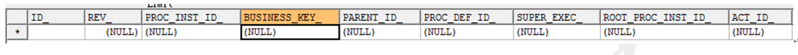
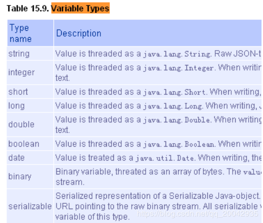
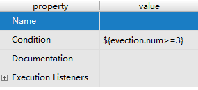
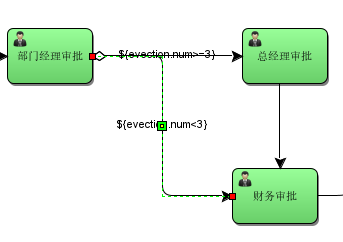
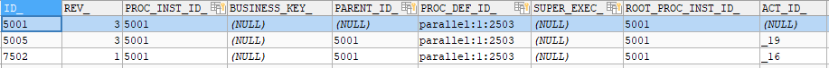
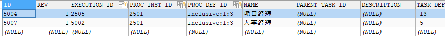
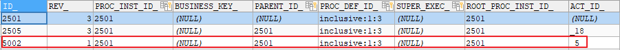

# Activiti进阶

## 一、流程实例

### 什么是流程实例

**流程实例**（ProcessInstance）代表流程定义的执行实例。

一个流程实例包括了所有的运行节点。我们可以利用这个对象来了解当前流程实例的进度等信息。

例如：用户或程序按照流程定义内容发起一个流程，这就是一个流程实例。

流程定义和流程实例的图解：


### 启动流程实例 并添加Businesskey（业务标识）

流程定义部署在activiti后，就可以在系统中通过activiti去管理该流程的执行，执行流程表示流程的一次执行。

比如部署系统出差流程后，如果某用户要申请出差这时就需要执行这个流程，如果另外一个用户也要申请出差则也需要执行该流程，每个执行互不影响，每个执行是单独的流程实例。

启动流程实例时，指定的businesskey，就会在act_ru_execution #流程实例的执行表中存储businesskey。

Businesskey：业务标识，通常为业务表的主键，业务标识和流程实例一一对应。业务标识来源于业务系统。存储业务标识就是根据业务标识来关联查询业务系统的数据。

比如：出差流程启动一个流程实例，就可以将出差单的id作为业务标识存储到activiti中，将来查询activiti的流程实例信息就可以获取出差单的id从而关联查询业务系统数据库得到出差单信息。

```java
    /**
     * 启动流程实例，添加businessKey
     */
    @Test
    public void addBusinessKey(){
//        1、得到ProcessEngine
        ProcessEngine processEngine = ProcessEngines.getDefaultProcessEngine();
//        2、得到RunTimeService
        RuntimeService runtimeService = processEngine.getRuntimeService();
//        3、启动流程实例，同时还要指定业务标识businessKey，也就是出差申请单id，这里是1001
        ProcessInstance processInstance = runtimeService.
                startProcessInstanceByKey("myEvection","1001");
//        4、输出processInstance相关属性
        System.out.println("业务id=="+processInstance.getBusinessKey());

    }
```

Activiti的act_ru_execution中存储业务标识：


### 操作数据库表

启动流程实例，操作如下数据库表：

SELECT * FROM act_ru_execution #流程实例执行表，记录当前流程实例的执行情况


说明：

流程实例执行，如果当前只有一个分支时，一个流程实例只有一条记录且执行表的主键id和流程实例id相同，如果当前有多个分支正在运行则该执行表中有多条记录，存在执行表的主键和流程实例id不相同的记录。**不论当前有几个分支总会有一条记录的执行表的主键和流程实例**id**相同** 

一个流程实例运行完成，此表中与流程实例相关的记录删除。

SELECT * FROM act_ru_task #任务执行表，记录当前执行的任务


说明：启动流程实例，流程当前执行到第一个任务结点，此表会插入一条记录表示当前任务的执行情况，如果任务完成则记录删除。

SELECT * FROM act_ru_identitylink #任务参与者，记录当前参与任务的用户或组


 

SELECT * FROM act_hi_procinst #流程实例历史表


流程实例启动，会在此表插入一条记录，流程实例运行完成记录也不会删除。

 SELECT * FROM act_hi_taskinst  #任务历史表，记录所有任务


开始一个任务，不仅在act_ru_task表插入记录，也会在历史任务表插入一条记录，任务历史表的主键就是任务id，任务完成此表记录不删除。

 SELECT * FROM act_hi_actinst  #活动历史表，记录所有活动


 

活动包括任务，所以此表中不仅记录了任务，还记录了流程执行过程的其它活动，比如开始事件、结束事件。

### 查询流程实例

流程在运行过程中可以查询流程实例的状态，当前运行结点等信息。

```java
@Test
	public void queryProcessInstance() {
		// 流程定义key
		String processDefinitionKey = "evection";
        ProcessEngine processEngine = ProcessEngines.getDefaultProcessEngine();
		// 获取RunTimeService
		RuntimeService runtimeService = processEngine.getRuntimeService();
		List<ProcessInstance> list = runtimeService
				.createProcessInstanceQuery()
				.processDefinitionKey(processDefinitionKey)//
				.list();

		for (ProcessInstance processInstance : list) {
			System.out.println("----------------------------");
			System.out.println("流程实例id："
					+ processInstance.getProcessInstanceId());
			System.out.println("所属流程定义id："
					+ processInstance.getProcessDefinitionId());
			System.out.println("是否执行完成：" + processInstance.isEnded());
			System.out.println("是否暂停：" + processInstance.isSuspended());
			System.out.println("当前活动标识：" + processInstance.getActivityId());
		}
	}

```


#### 关联BusinessKey

需求：

在activiti实际应用时，查询流程实例列表时可能要显示出业务系统的一些相关信息，比如：查询当前运行的出差流程列表需要将出差单名称、出差天数等信息显示出来，出差天数等信息在业务系统中存在，而并没有在activiti数据库中存在，所以是无法通过activiti的api查询到出差天数等信息。

 

实现：

在查询流程实例时，通过businessKey（业务标识 ）关联查询业务系统的出差单表，查询出出差天数等信息。

通过下面的代码就可以获取activiti中所对应实例保存的业务Key。而这个业务Key一般都会保存相关联的业务操作表的主键，再通过主键ID去查询业务信息，比如通过出差单的ID，去查询更多的请假信息（出差人，出差时间，出差天数，出差目的地等）

String businessKey = processInstance.getBusinessKey();

 

在activiti的act_ru_execution表，字段BUSINESS_KEY就是存放业务KEY的。



### 挂起、激活流程实例

某些情况可能由于流程变更需要将当前运行的流程暂停而不是直接删除，流程暂停后将不会继续执行。

#### 全部流程实例挂起

操作流程定义为挂起状态，该流程定义下边所有的流程实例全部暂停：

流程定义为挂起状态该流程定义将不允许启动新的流程实例，同时该流程定义下所有的流程实例将全部挂起暂停执行。

```java
/**
     * 全部流程实例挂起与激活
     */
    @Test
    public void SuspendAllProcessInstance(){
//        获取processEngine
        ProcessEngine processEngine = ProcessEngines.getDefaultProcessEngine();
//        获取repositoryService
        RepositoryService repositoryService = processEngine.getRepositoryService();
//        查询流程定义的对象
        ProcessDefinition processDefinition = repositoryService.createProcessDefinitionQuery().
                processDefinitionKey("myEvection").
                singleResult();
//        得到当前流程定义的实例是否都为暂停状态
        boolean suspended = processDefinition.isSuspended();
//        流程定义id
        String processDefinitionId = processDefinition.getId();
//        判断是否为暂停
        if(suspended){
//         如果是暂停，可以执行激活操作 ,参数1 ：流程定义id ，参数2：是否激活，参数3：激活时间
            repositoryService.activateProcessDefinitionById(processDefinitionId,
                    true,
                    null
            );
            System.out.println("流程定义："+processDefinitionId+",已激活");
        }else{
//          如果是激活状态，可以暂停，参数1 ：流程定义id ，参数2：是否暂停，参数3：暂停时间
            repositoryService.suspendProcessDefinitionById(processDefinitionId,
                    true,
                    null);
            System.out.println("流程定义："+processDefinitionId+",已挂起");
        }

    }

```


#### 单个流程实例挂起

操作流程实例对象，针对单个流程执行挂起操作，某个流程实例挂起则此流程不再继续执行，完成该流程实例的当前任务将报异常。

```java
/**
     * 单个流程实例挂起与激活
     */
    @Test
    public void SuspendSingleProcessInstance(){
//        获取processEngine
        ProcessEngine processEngine = ProcessEngines.getDefaultProcessEngine();
//        RuntimeService
        RuntimeService runtimeService = processEngine.getRuntimeService();
//        查询流程定义的对象
        ProcessInstance processInstance = runtimeService.
                createProcessInstanceQuery().
                processInstanceId("15001").
                singleResult();
//        得到当前流程定义的实例是否都为暂停状态
        boolean suspended = processInstance.isSuspended();
//        流程定义id
        String processDefinitionId = processInstance.getId();
//        判断是否为暂停
        if(suspended){
//         如果是暂停，可以执行激活操作 ,参数：流程定义id
            runtimeService.activateProcessInstanceById(processDefinitionId);
            System.out.println("流程定义："+processDefinitionId+",已激活");
        }else{
//          如果是激活状态，可以暂停，参数：流程定义id
            runtimeService.suspendProcessInstanceById( processDefinitionId);
            System.out.println("流程定义："+processDefinitionId+",已挂起");
        }

    }

    /**
     * 测试完成个人任务
     */
    @Test
    public void completTask(){
//        获取引擎
        ProcessEngine processEngine = ProcessEngines.getDefaultProcessEngine();
//        获取操作任务的服务 TaskService
        TaskService taskService = processEngine.getTaskService();
//        完成任务,参数：流程实例id,完成zhangsan的任务
        Task task = taskService.createTaskQuery()
                .processInstanceId("15001")
                .taskAssignee("rose")
                .singleResult();


        System.out.println("流程实例id="+task.getProcessInstanceId());
        System.out.println("任务Id="+task.getId());
        System.out.println("任务负责人="+task.getAssignee());
        System.out.println("任务名称="+task.getName());
        taskService.complete(task.getId());
    }
```


## 二、个人任务

### 2.1、分配任务负责人

#### 2.1.1、固定分配

在进行业务流程建模时指定固定的任务负责人， 如图：


并在 properties 视图中，填写 Assignee 项为任务负责人。 

#### 2.1.2、表达式分配

由于固定分配方式，任务只管一步一步执行任务，执行到每一个任务将按照 bpmn 的配置去分配任
务负责人。 

##### 2.1.2.1、UEL 表达式 

Activiti 使用 UEL 表达式， UEL 是 java EE6 规范的一部分， UEL（Unified Expression Language）即 统一表达式语言， activiti 支持两个 UEL 表达式： UEL-value 和 UEL-method。 

###### 1）UEL-value 定义

如图： 


assignee 这个变量是 activiti 的一个流程变量，

或者使用这种方式定义：

如图：


 user 也是 activiti 的一个流程变量， user.assignee 表示通过调用 user 的 getter 方法获取值。 

###### 2）UEL-method 方式

如图： 


userBean 是 spring 容器中的一个 bean，表示调用该 bean 的 getUserId()方法。 

###### 3）UEL-method 与 UEL-value 结合 

再比如：
${ldapService.findManagerForEmployee(emp)}
ldapService 是 spring 容器的一个 bean，findManagerForEmployee 是该 bean 的一个方法，emp 是 activiti
流程变量， emp 作为参数传到 ldapService.findManagerForEmployee 方法中。 

###### 4）其它

表达式支持解析基础类型、 bean、 list、 array 和 map，也可作为条件判断。
如下：
${order.price > 100 && order.price < 250} 


##### 2.1.2.2、编写代码配置负责人 

###### 1)定义任务分配流程变量 

如图：


###### 2)设置流程变量 

在启动流程实例时设置流程变量，如下： 

```java
 /**
     * 设置流程负责人
     */
    @Test
    public void assigneeUEL(){
//      获取流程引擎
        ProcessEngine processEngine = ProcessEngines.getDefaultProcessEngine();
//        获取 RuntimeService
        RuntimeService runtimeService = processEngine.getRuntimeService();
//        设置assignee的取值，用户可以在界面上设置流程的执行
        Map<String,Object> assigneeMap = new HashMap<>();
        assigneeMap.put("assignee0","张三");
        assigneeMap.put("assignee1","李经理");
        assigneeMap.put("assignee2","王总经理");
        assigneeMap.put("assignee3","赵财务");
//        启动流程实例，同时还要设置流程定义的assignee的值
        runtimeService.startProcessInstanceByKey("myEvection1",assigneeMap);
//       输出
        System.out.println(processEngine.getName());
    }
```

执行成功后，可以在act_ru_variable表中看到刚才map中的数据


##### 2.1.2.3、注意事项 

由于使用了表达式分配，必须保证在任务执行过程表达式执行成功，比如：
某个任务使用了表达式${order.price > 100 && order.price < 250}，当执行该任务时必须保证 order 在
流程变量中存在，否则 activiti 异常。 

#### 2.1.3、监听器分配

可以使用监听器来完成很多Activiti流程的业务。

在本章我们使用监听器的方式来指定负责人，那么在流程设计时就不需要指定assignee。

任务监听器是发生对应的任务相关事件时执行自定义 java 逻辑 或表达式。
任务相当事件包括：  


Event的选项包含：

```
Create：任务创建后触发
Assignment：任务分配后触发
Delete：任务完成后触发
All：所有事件发生都触发
```

定义任务监听类，且类必须实现 org.activiti.engine.delegate.TaskListener 接口 

```java
public class MyTaskListener implements TaskListener {
    @Override
    public void notify(DelegateTask delegateTask) {
        if(delegateTask.getName().equals("创建出差申请")&&
                delegateTask.getEventName().equals("create")){
            //这里指定任务负责人
            delegateTask.setAssignee("张三");
        }
    }
} 
```

DelegateTask对象的内容如下：


##### 2.1.3.1、注意事项 

使用监听器分配方式，按照监听事件去执行监听类的 notify 方法，方法如果不能正常执行也会影响
任务的执行。 

### 2.2、查询任务

#### 查询任务负责人的待办任务 

代码如下：

```java
// 查询当前个人待执行的任务
@Test
public void findPersonalTaskList() {
    // 流程定义key
    String processDefinitionKey = "myEvection1";
    // 任务负责人
    String assignee = "张三";
    // 获取TaskService
    TaskService taskService = processEngine.getTaskService();
    List<Task> taskList = taskService.createTaskQuery()
    	.processDefinitionKey(processDefinitionKey)
    	.includeProcessVariables()
        .taskAssignee(assignee)
        .list();
    for (Task task : taskList) {
        System.out.println("----------------------------");
        System.out.println("流程实例id： " + task.getProcessInstanceId());
        System.out.println("任务id： " + task.getId());
        System.out.println("任务负责人： " + task.getAssignee());
        System.out.println("任务名称： " + task.getName());
    }
}
```

#### 关联 businessKey 

需求：
在 activiti 实际应用时，查询待办任务可能要显示出业务系统的一些相关信息。

比如：查询待审批出差任务列表需要将出差单的日期、 出差天数等信息显示出来。

出差天数等信息在业务系统中存在，而并没有在 activiti 数据库中存在，所以是无法通过 activiti 的 api 查询到出差天数等信息。
实现：
在查询待办任务时，通过 businessKey（业务标识 ）关联查询业务系统的出差单表，查询出出差天数等信息。 

```java
@Test
    public void findProcessInstance(){
//        获取processEngine
        ProcessEngine processEngine = ProcessEngines.getDefaultProcessEngine();
//        获取TaskService
        TaskService taskService = processEngine.getTaskService();
//        获取RuntimeService
        RuntimeService runtimeService = processEngine.getRuntimeService();
//        查询流程定义的对象
        Task task = taskService.createTaskQuery()
                .processDefinitionKey("myEvection1")
                .taskAssignee("张三")
                .singleResult();
//        使用task对象获取实例id
        String processInstanceId = task.getProcessInstanceId();
//          使用实例id，获取流程实例对象
        ProcessInstance processInstance = runtimeService.createProcessInstanceQuery()
                .processInstanceId(processInstanceId)
                .singleResult();
//        使用processInstance，得到 businessKey
        String businessKey = processInstance.getBusinessKey();

        System.out.println("businessKey=="+businessKey);

    }
```


### 2.3、办理任务

注意：在实际应用中，完成任务前需要校验任务的负责人是否具有该任务的办理权限 。

```java
/**
     * 完成任务，判断当前用户是否有权限
     */
    @Test
    public void completTask() {
        //任务id
        String taskId = "15005";
//        任务负责人
        String assingee = "张三";
        //获取processEngine
        ProcessEngine processEngine = ProcessEngines.getDefaultProcessEngine();
        // 创建TaskService
        TaskService taskService = processEngine.getTaskService();
//        完成任务前，需要校验该负责人可以完成当前任务
//        校验方法：
//        根据任务id和任务负责人查询当前任务，如果查到该用户有权限，就完成
        Task task = taskService.createTaskQuery()
                .taskId(taskId)
                .taskAssignee(assingee)
                .singleResult();
        if(task != null){
            taskService.complete(taskId);
            System.out.println("完成任务");
        }
    }
```


## 三、流程变量

### 3.1、什么是流程变量 

流程变量在 activiti 中是一个非常重要的角色，流程运转有时需要靠流程变量，业务系统和 activiti
结合时少不了流程变量，流程变量就是 activiti 在管理工作流时根据管理需要而设置的变量。
比如：在出差申请流程流转时如果出差天数大于 3 天则由总经理审核，否则由人事直接审核， 出差天
数就可以设置为流程变量，在流程流转时使用。 

**注意：虽然流程变量中可以存储业务数据可以通过activiti的api查询流程变量从而实现 查询业务数据，但是不建议这样使用，因为业务数据查询由业务系统负责，activiti设置流程变量是为了流程执行需要而创建。**

### 3.2、流程变量类型 

如果将 pojo 存储到流程变量中，必须实现序列化接口 serializable，为了防止由于新增字段无
法反序列化，需要生成 serialVersionUID。 



### 3.3、流程变量作用域 

流程变量的作用域可以是一个流程实例(processInstance)，或一个任务(task)，或一个执行实例
(execution)

#### 3.3.1、globa变量

流程变量的默认作用域是流程实例。当一个流程变量的作用域为流程实例时，可以称为 global 变量

注意：

如：    Global变量：userId（变量名）、zhangsan（变量值）

global 变量中变量名不允许重复，设置相同名称的变量，后设置的值会覆盖前设置的变量值。

#### 3.3.2、local变量

任务和执行实例仅仅是针对一个任务和一个执行实例范围，范围没有流程实例大， 称为 local 变量。

Local 变量由于在不同的任务或不同的执行实例中，作用域互不影响，变量名可以相同没有影响。Local 变量名也可以和 global 变量名相同，没有影响。 

### 3.4、流程变量的使用方法 

#### 3.4.1、在属性上使用UEL表达式

可以在 assignee 处设置 UEL 表达式，表达式的值为任务的负责人，比如： ${assignee}， assignee 就是一个流程变量名称。

Activiti获取UEL表达式的值，即流程变量assignee的值 ，将assignee的值作为任务的负责人进行任务分配

#### 3.4.2、在连线上使用UEL表达式

可以在连线上设置UEL表达式，决定流程走向。

比如：${price<10000} 。price就是一个流程变量名称，uel表达式结果类型为布尔类型。

如果UEL表达式是true，要决定 流程执行走向。

### 3.5、使用Global变量控制流程

#### 3.5.1、需求

员工创建出差申请单，由部门经理审核，部门经理审核通过后出差3天及以下由人财务直接审批，3天以上先由总经理审核，总经理审核通过再由财务审批。


#### 3.5.2、流程定义

1）、出差天数大于等于3连线条件


也可以使用对象参数命名，如evection.num：




2）、出差天数小于3连线条件


也可以使用对象参数命名，如：



#### 3.5.3、设置global流程变量

在部门经理审核前设置流程变量，变量值为出差单信息（包括出差天数），部门经理审核后可以根据流程变量的值决定流程走向。

在设置流程变量时，可以在启动流程时设置，也可以在任务办理时设置

##### 3.5.3.1、创建POJO对象

创建出差申请pojo对象

```java
package com.itheima.demo.pojo;

import java.io.Serializable;
import java.util.Date;

/**
 * 出差申请 pojo
 */
public class Evection implements Serializable {
    /**
     * 主键id
     */
    private Long id;
    /**
     * 出差申请单名称
     */
    private String evectionName;
    /**
     * 出差天数
     */
    private Double num;
    /**
     * 预计开始时间
     */
    private Date beginDate;
    /**
     * 预计结束时间
     */
    private Date endDate;
    /**
     * 目的地
     */
    private String destination;
    /**
     * 出差事由
     */
    private String reson;

    public Long getId() {
        return id;
    }

    public void setId(Long id) {
        this.id = id;
    }

    public String getEvectionName() {
        return evectionName;
    }

    public void setEvectionName(String evectionName) {
        this.evectionName = evectionName;
    }

    public Date getBeginDate() {
        return beginDate;
    }

    public void setBeginDate(Date beginDate) {
        this.beginDate = beginDate;
    }

    public Date getEndDate() {
        return endDate;
    }

    public void setEndDate(Date endDate) {
        this.endDate = endDate;
    }

    public String getDestination() {
        return destination;
    }

    public void setDestination(String destination) {
        this.destination = destination;
    }

    public String getReson() {
        return reson;
    }

    public void setReson(String reson) {
        this.reson = reson;
    }

    public Double getNum() {
        return num;
    }

    public void setNum(Double num) {
        this.num = num;
    }
}

```

##### 3.5.3.2、启动流程时设置变量

在启动流程时设置流程变量，变量的作用域是整个流程实例。

通过Map<key,value>设置流程变量，map中可以设置多个变量，这个key就是流程变量的名字。

```java
    /**
     * 启动流程实例,设置流程变量的值
     */
    @Test
    public void startProcess(){
//        获取流程引擎
        ProcessEngine processEngine = ProcessEngines.getDefaultProcessEngine();
//        获取RunTimeService
        RuntimeService runtimeService = processEngine.getRuntimeService();
//        流程定义key
        String key = "myEvection2";
//       创建变量集合
        Map<String, Object> map = new HashMap<>();
//        创建出差pojo对象
        Evection evection = new Evection();
//        设置出差天数
        evection.setNum(2d);
//      定义流程变量，把出差pojo对象放入map
        map.put("evection",evection);
//      设置assignee的取值，用户可以在界面上设置流程的执行
        map.put("assignee0","张三");
        map.put("assignee1","李经理");
        map.put("assignee2","王总经理");
        map.put("assignee3","赵财务");
//        启动流程实例，并设置流程变量的值（把map传入）
        ProcessInstance processInstance = runtimeService
                .startProcessInstanceByKey(key, map);
//      输出
        System.out.println("流程实例名称="+processInstance.getName());
        System.out.println("流程定义id=="+processInstance.getProcessDefinitionId());

    }
    /**
     * 完成任务，判断当前用户是否有权限
     */
    @Test
    public void completTask() {
        //任务id
        String key = "myEvection2";
//        任务负责人
        String assingee = "张三";
        //获取processEngine
        ProcessEngine processEngine = ProcessEngines.getDefaultProcessEngine();
        // 创建TaskService
        TaskService taskService = processEngine.getTaskService();
//        完成任务前，需要校验该负责人可以完成当前任务
//        校验方法：
//        根据任务id和任务负责人查询当前任务，如果查到该用户有权限，就完成
        Task task = taskService.createTaskQuery()
                .processDefinitionKey(key)
                .taskAssignee(assingee)
                .singleResult();
        if(task != null){
            taskService.complete(task.getId());
            System.out.println("任务执行完成");
        }
    }
```

说明：

startProcessInstanceByKey(processDefinitionKey, variables)

流程变量作用域是一个流程实例，流程变量使用Map存储，同一个流程实例设置变量map中key相同，后者覆盖前者。

##### 3.5.3.2、任务办理时设置变量

在完成任务时设置流程变量，该流程变量只有在该任务完成后其它结点才可使用该变量，它的作用域是整个流程实例，如果设置的流程变量的key在流程实例中已存在相同的名字则后设置的变量替换前边设置的变量。

这里需要在创建出差单任务完成时设置流程变量

```java
    /**
     * 完成任务，判断当前用户是否有权限
     */
    @Test
    public void completTask() {
        //任务id
        String key = "myEvection2";
//        任务负责人
        String assingee = "张三";
//       获取processEngine
        ProcessEngine processEngine = ProcessEngines.getDefaultProcessEngine();
//       创建TaskService
        TaskService taskService = processEngine.getTaskService();
//       创建变量集合
        Map<String, Object> map = new HashMap<>();
//        创建出差pojo对象
        Evection evection = new Evection();
//        设置出差天数
        evection.setNum(2d);
//      定义流程变量
        map.put("evection",evection);
//        完成任务前，需要校验该负责人可以完成当前任务
//        校验方法：
//        根据任务id和任务负责人查询当前任务，如果查到该用户有权限，就完成
        Task task = taskService.createTaskQuery()
                .processDefinitionKey(key)
                .taskAssignee(assingee)
                .singleResult();
        if(task != null){
            //完成任务是，设置流程变量的值
            taskService.complete(task.getId(),map);
            System.out.println("任务执行完成");
        }
    }
```

说明：

通过当前任务设置流程变量，需要指定当前任务id，如果当前执行的任务id不存在则抛出异常。

任务办理时也是通过map<key,value>设置流程变量，一次可以设置多个变量。

##### 3.5.3.3、通过当前流程实例设置

通过流程实例id设置全局变量，该流程实例必须未执行完成。

```java
    @Test
    public void setGlobalVariableByExecutionId(){
//    当前流程实例执行 id，通常设置为当前执行的流程实例
        String executionId="2601";
//     获取processEngine
        ProcessEngine processEngine = ProcessEngines.getDefaultProcessEngine();
//        获取RuntimeService
        RuntimeService runtimeService = processEngine.getRuntimeService();
//        创建出差pojo对象
        Evection evection = new Evection();
//        设置天数
        evection.setNum(3d);
//      通过流程实例 id设置流程变量
        runtimeService.setVariable(executionId, "evection", evection);
//      一次设置多个值
//      runtimeService.setVariables(executionId, variables)
    }

```

注意：

executionId必须当前未结束 流程实例的执行id，通常此id设置流程实例 的id。也可以通runtimeService.getVariable()获取流程变量。

##### 3.5.3.4、通过当前任务设置

```java
@Test
	public void setGlobalVariableByTaskId(){
		
		//当前待办任务id
		String taskId="1404";
//     获取processEngine
        ProcessEngine processEngine = ProcessEngines.getDefaultProcessEngine();
		TaskService taskService = processEngine.getTaskService();
		Evection evection = new Evection();
		evection.setNum(3);
		//通过任务设置流程变量
		taskService.setVariable(taskId, "evection", evection);
		//一次设置多个值 
		//taskService.setVariables(taskId, variables)
	}

```

注意：

任务id必须是当前待办任务id，act_ru_task中存在。如果该任务已结束，会报错

也可以通过taskService.getVariable()获取流程变量。

#### 3.5.4、测试

正常测试：

​       设置流程变量的值大于等于3天

​       设计流程变量的值小于3天

异常测试：

​       流程变量不存在

​       流程变量的值为空NULL，price属性为空

​       UEL表达式都不符合条件  

​      不设置连线的条件

#### 3.5.5、注意事项

1、  如果UEL表达式中流程变量名不存在则报错。

2、  如果UEL表达式中流程变量值为空NULL，流程不按UEL表达式去执行，而流程结束 。

3、  如果UEL表达式都不符合条件，流程结束 

4、  如果连线不设置条件，会走flow序号小的那条线

#### 3.5.6、操作数据库表

设置流程变量会在当前执行流程变量表插入记录，同时也会在历史流程变量表也插入记录。

 ```sql
//当前流程变量表
SELECT * FROM act_ru_variable 
 ```

记录当前运行流程实例可使用的流程变量，包括 global和local变量

Id_：主键

Type_：变量类型

Name_：变量名称 

Execution_id_：所属流程实例执行id，global和local变量都存储

Proc_inst_id_：所属流程实例id，global和local变量都存储 

Task_id_：所属任务id，local变量存储

Bytearray_：serializable类型变量存储对应act_ge_bytearray表的id

Double_：double类型变量值

Long_：long类型变量值

Text_：text类型变量值 

```sql
 #历史流程变量表
SELECT * FROM act_hi_varinst 
```

记录所有已创建的流程变量，包括 global和local变量

字段意义参考当前流程变量表。

### 3.6、设置local流程变量

#### 3.6.1、任务办理时设置

 任务办理时设置local流程变量，当前运行的流程实例只能在该任务结束前使用，任务结束该变量无法在当前流程实例使用，可以通过查询历史任务查询。

```java
/*
*处理任务时设置local流程变量
*/
@Test
public void completTask() {
   //任务id
   String taskId = "1404";
//  获取processEngine
    ProcessEngine processEngine = ProcessEngines.getDefaultProcessEngine();
    TaskService taskService = processEngine.getTaskService();
//  定义流程变量
   Map<String, Object> variables = new HashMap<String, Object>();
   Evection evection = new Evection ();
   evection.setNum(3d);
// 定义流程变量
   Map<String, Object> variables = new HashMap<String, Object>();
//  变量名是holiday，变量值是holiday对象
    variables.put("evection", evection);
//  设置local变量，作用域为该任务
    taskService.setVariablesLocal(taskId, variables);
//  完成任务
   taskService.complete(taskId);
}
```


​       说明：

设置作用域为任务的local变量，每个任务可以设置同名的变量，互不影响。

#### 3.6.2、通过当前任务设置

```java
@Test
public void setLocalVariableByTaskId(){
//   当前待办任务id
    String taskId="1404";
//  获取processEngine
    ProcessEngine processEngine = ProcessEngines.getDefaultProcessEngine();
    TaskService taskService = processEngine.getTaskService();
    Evection evection = new Evection ();
    evection.setNum(3d);
//  通过任务设置流程变量
    taskService.setVariableLocal(taskId, "evection", evection);
//  一次设置多个值 
    //taskService.setVariablesLocal(taskId, variables)
}
```

注意：

任务id必须是当前待办任务id，act_ru_task中存在。

#### 3.6.3、  Local变量测试1

如果上边例子中设置global变量改为设置local变量是否可行？为什么？

 Local变量在任务结束后无法在当前流程实例执行中使用，如果后续的流程执行需要用到此变量则会报错。

####  3.6.4、  Local变量测试2

在部门经理审核、总经理审核、财务审核时设置local变量，可通过historyService查询每个历史任务时将流程变量的值也查询出来。

 代码如下：

```java
// 创建历史任务查询对象
      HistoricTaskInstanceQuery historicTaskInstanceQuery = historyService.createHistoricTaskInstanceQuery();
      // 查询结果包括 local变量
      historicTaskInstanceQuery.includeTaskLocalVariables();
for (HistoricTaskInstance historicTaskInstance : list) {
         System.out.println("==============================");
         System.out.println("任务id：" + historicTaskInstance.getId());
         System.out.println("任务名称：" + historicTaskInstance.getName());
         System.out.println("任务负责人：" + historicTaskInstance.getAssignee());
     System.out.println("任务local变量："+ historicTaskInstance.getTaskLocalVariables());

}
```

注意：查询历史流程变量，特别是查询pojo变量需要经过反序列化，不推荐使用。

## 四、组任务

### 4.1、需求

在流程定义中在任务结点的 assignee 固定设置任务负责人，在流程定义时将参与者固定设置在.bpmn 文件中，如果临时任务负责人变更则需要修改流程定义，系统可扩展性差。

针对这种情况可以给任务设置多个候选人，可以从候选人中选择参与者来完成任务。 

### 4.2、设置任务候选人 

在流程图中任务节点的配置中设置 candidate-users(候选人)，多个候选人之间用逗号分开。 


查看bpmn文件

```xml
<userTask activiti:candidateUsers="lisi,wangwu" activiti:exclusive="true" id="_3" name="经理审批"/>
```

我们可以看到部门经理的审核人已经设置为 lisi,wangwu 这样的一组候选人，可以使用

activiti:candiateUsers=”用户 1,用户 2,用户 3”的这种方式来实现设置一组候选人 

### 4.3、组任务 

#### 4.3.1、组任务办理流程

#####  a、查询组任务

指定候选人，查询该候选人当前的待办任务。

候选人不能立即办理任务。

#####  b、拾取(claim)任务

该组任务的所有候选人都能拾取。

将候选人的组任务，变成个人任务。原来候选人就变成了该任务的负责人。

如果拾取后不想办理该任务？

   需要将已经拾取的个人任务归还到组里边，将个人任务变成了组任务。

##### c、查询个人任务

查询方式同个人任务部分，根据assignee查询用户负责的个人任务。

#####  d、办理个人任务

#### 4.3.2、  查询组任务

 根据候选人查询组任务

 ```java
@Test
    public void findGroupTaskList() {
       // 流程定义key
       String processDefinitionKey = "evection3";
       // 任务候选人
       String candidateUser = "lisi";
        //  获取processEngine
       ProcessEngine processEngine = ProcessEngines.getDefaultProcessEngine();
       // 创建TaskService
       TaskService taskService = processEngine.getTaskService();
       //查询组任务
       List<Task> list = taskService.createTaskQuery()
              .processDefinitionKey(processDefinitionKey)
              .taskCandidateUser(candidateUser)//根据候选人查询
              .list();
       for (Task task : list) {
           System.out.println("----------------------------");
           System.out.println("流程实例id：" + task.getProcessInstanceId());
           System.out.println("任务id：" + task.getId());
           System.out.println("任务负责人：" + task.getAssignee());
           System.out.println("任务名称：" + task.getName());
       }
    }
 ```


#### 4.3.3 、 拾取组任务

 候选人员拾取组任务后该任务变为自己的个人任务。

 ```java
@Test
    public void claimTask(){
         //  获取processEngine
       ProcessEngine processEngine = ProcessEngines.getDefaultProcessEngine();
       TaskService taskService = processEngine.getTaskService();
       //要拾取的任务id
       String taskId = "6302";
       //任务候选人id
       String userId = "lisi";
       //拾取任务
       //即使该用户不是候选人也能拾取(建议拾取时校验是否有资格)    
       //校验该用户有没有拾取任务的资格
       Task task = taskService.createTaskQuery()
              .taskId(taskId)
              .taskCandidateUser(userId)//根据候选人查询
              .singleResult();
       if(task!=null){
         //拾取任务
           taskService.claim(taskId, userId);
           System.out.println("任务拾取成功");
       }
    }
 ```

说明：即使该用户不是候选人也能拾取，建议拾取时校验是否有资格

组任务拾取后，该任务已有负责人，通过候选人将查询不到该任务

####  4.3.4、  查询个人待办任务

 查询方式同个人任务查询

 ```java
@Test
public void findPersonalTaskList() {
    // 流程定义key
    String processDefinitionKey = "evection1";
    // 任务负责人
    String assignee = "zhangsan";
     //  获取processEngine
       ProcessEngine processEngine = ProcessEngines.getDefaultProcessEngine();
    // 创建TaskService
    TaskService taskService = processEngine.getTaskService();
    List<Task> list = taskService.createTaskQuery()
        .processDefinitionKey(processDefinitionKey)
        .taskAssignee(assignee)
        .list();
    for (Task task : list) {
        System.out.println("----------------------------");
        System.out.println("流程实例id：" + task.getProcessInstanceId());
        System.out.println("任务id：" + task.getId());
        System.out.println("任务负责人：" + task.getAssignee());
        System.out.println("任务名称：" + task.getName());
    }
}
 ```

#### 4.3.5、  办理个人任务

同个人任务办理

```java
 /*完成任务*/
   @Test
   public void completeTask(){
//     任务ID
      String taskId = "12304";
//     获取processEngine
      ProcessEngine processEngine = ProcessEngines.getDefaultProcessEngine();
      processEngine.getTaskService()
                   .complete(taskId);
      System.out.println("完成任务："+taskId);
   }
```

说明：建议完成任务前校验该用户是否是该任务的负责人。

#### 4.3.6、  归还组任务

 如果个人不想办理该组任务，可以归还组任务，归还后该用户不再是该任务的负责人

```java
/*
*归还组任务，由个人任务变为组任务，还可以进行任务交接
*/
@Test
public void setAssigneeToGroupTask() {
    //  获取processEngine
       ProcessEngine processEngine = ProcessEngines.getDefaultProcessEngine();
   // 查询任务使用TaskService
   TaskService taskService = processEngine.getTaskService();
   // 当前待办任务
   String taskId = "6004";
   // 任务负责人
   String userId = "zhangsan2";
    // 校验userId是否是taskId的负责人，如果是负责人才可以归还组任务
   Task task = taskService
       .createTaskQuery()
       .taskId(taskId)
       .taskAssignee(userId)
       .singleResult();
    if (task != null) {
       // 如果设置为null，归还组任务,该 任务没有负责人
       taskService.setAssignee(taskId, null);
    }
}
```

 说明：建议归还任务前校验该用户是否是该任务的负责人

也可以通过setAssignee方法将任务委托给其它用户负责，注意被委托的用户可以不是候选人（建议不要这样使用）

#### 4.3.7、  任务交接

任务交接,任务负责人将任务交给其它候选人办理该任务

 ```java
@Test
    public void setAssigneeToCandidateUser() {
        //  获取processEngine
       ProcessEngine processEngine = ProcessEngines.getDefaultProcessEngine();
       // 查询任务使用TaskService
       TaskService taskService = processEngine.getTaskService();
       // 当前待办任务
       String taskId = "6004";
       // 任务负责人
       String userId = "zhangsan2";
// 将此任务交给其它候选人办理该 任务
           String candidateuser = "zhangsan";
       // 校验userId是否是taskId的负责人，如果是负责人才可以归还组任务
       Task task = taskService
           .createTaskQuery()
           .taskId(taskId)
           .taskAssignee(userId)
           .singleResult();
       if (task != null) {
           taskService.setAssignee(taskId, candidateuser);
       }
    }
 ```


#### 4.3.8、  数据库表操作

查询当前任务执行表

```sql
SELECT * FROM act_ru_task 
```

任务执行表，记录当前执行的任务，由于该任务当前是组任务，所有assignee为空，当拾取任务后该字段就是拾取用户的id

查询任务参与者

```sql
SELECT * FROM act_ru_identitylink
```

 任务参与者，记录当前参考任务用户或组，当前任务如果设置了候选人，会向该表插入候选人记录，有几个候选就插入几个

与act_ru_identitylink对应的还有一张历史表act_hi_identitylink，向act_ru_identitylink插入记录的同时也会向历史表插入记录。任务完成

## 五、网关

网关用来控制流程的流向

### 5.1 排他网关ExclusiveGateway

#### 5.1.1  什么是排他网关：

排他网关，用来在流程中实现决策。 当流程执行到这个网关，所有分支都会判断条件是否为true，如果为true则执行该分支，

**注意**：排他网关只会选择一个为true的分支执行。如果有两个分支条件都为true，排他网关会选择id值较小的一条分支去执行。

为什么要用排他网关？

不用排他网关也可以实现分支，如：在连线的condition条件上设置分支条件。

在连线设置condition条件的缺点：如果条件都不满足，流程就结束了(是异常结束)。

如果 使用排他网关决定分支的走向，如下：


 

如果从网关出去的线所有条件都不满足则系统抛出异常。

```java
org.activiti.engine.ActivitiException: No outgoing sequence flow of the exclusive gateway 'exclusivegateway1' could be selected for continuing the process
   at org.activiti.engine.impl.bpmn.behavior.ExclusiveGatewayActivityBehavior.leave(ExclusiveGatewayActivityBehavior.java:85)

```


#### 5.1.2  流程定义

 排他网关图标，红框内：


 

#### 5.1.3  测试 

在部门经理审核后，走排他网关，从排他网关出来的分支有两条，一条是判断出差天数是否大于3天，另一条是判断出差天数是否小于等于3天。

设置分支条件时，如果所有分支条件都不是true，报错：

```java
org.activiti.engine.ActivitiException: No outgoing sequence flow of the exclusive gateway 'exclusivegateway1' could be selected for continuing the process

       at org.activiti.engine.impl.bpmn.behavior.ExclusiveGatewayActivityBehavior.leave(ExclusiveGatewayActivityBehavior.java:85)

```

### 5.2 并行网关ParallelGateway

#### 5.2.1  什么是并行网关

并行网关允许将流程分成多条分支，也可以把多条分支汇聚到一起，并行网关的功能是基于进入和外出顺序流的：

l  fork分支：

 并行后的所有外出顺序流，为每个顺序流都创建一个并发分支。

l  join汇聚： 

所有到达并行网关，在此等待的进入分支， 直到所有进入顺序流的分支都到达以后， 流程就会通过汇聚网关。

注意，如果同一个并行网关有多个进入和多个外出顺序流， 它就同时具有分支和汇聚功能。 这时，网关会先汇聚所有进入的顺序流，然后再切分成多个并行分支。

**与其他网关的主要区别是，并行网关不会解析条件。** **即使顺序流中定义了条件，也会被忽略。**

例子：


说明：

技术经理和项目经理是两个execution分支，在act_ru_execution表有两条记录分别是技术经理和项目经理，act_ru_execution还有一条记录表示该流程实例。

待技术经理和项目经理任务全部完成，在汇聚点汇聚，通过parallelGateway并行网关。

并行网关在业务应用中常用于会签任务，会签任务即多个参与者共同办理的任务。

#### 5.2.2  流程定义

并行网关图标，红框内：


 

#### 5.2.3  测试

当执行到并行网关数据库跟踪如下：

当前任务表：SELECT * FROM act_ru_task   


上图中：有两个任务当前执行。

查询流程实例执行表：SELECT * FROM act_ru_execution 


上图中，说明当前流程实例有多个分支(两个)在运行。

对并行任务的执行：

并行任务执行不分前后，由任务的负责人去执行即可。

执行技术经理任务后，查询当前任务表 SELECT * FROM act_ru_task   


已完成的技术经理任务在当前任务表act_ru_task_已被删除。

在流程实例执行表：SELECT * FROM act_ru_execution有中多个分支存在且有并行网关的汇聚结点。




有并行网关的汇聚结点：说明有一个分支已经到汇聚，等待其它的分支到达。

当所有分支任务都完成，都到达汇聚结点后：

流程实例执行表：SELECT * FROM act_ru_execution，执行流程实例已经变为总经理审批，说明流程执行已经通过并行网关


总结：所有分支到达汇聚结点，并行网关执行完成。         

### 5.3    包含网关InclusiveGateway

#### 5.3.1  什么是包含网关

包含网关可以看做是排他网关和并行网关的结合体。 

和排他网关一样，你可以在外出顺序流上定义条件，包含网关会解析它们。 但是主要的区别是包含网关可以选择多于一条顺序流，这和并行网关一样。

包含网关的功能是基于进入和外出顺序流的：

l  分支： 

所有外出顺序流的条件都会被解析，结果为true的顺序流会以并行方式继续执行， 会为每个顺序流创建一个分支。

l  汇聚：

 所有并行分支到达包含网关，会进入等待状态， 直到每个包含流程token的进入顺序流的分支都到达。 这是与并行网关的最大不同。换句话说，包含网关只会等待被选中执行了的进入顺序流。 在汇聚之后，流程会穿过包含网关继续执行。

#### 5.3.2  流程定义：

出差申请大于等于3天需要由项目经理审批，小于3天由技术经理审批，出差申请必须经过人事经理审批。

 包含网关图标，红框内：

 

定义流程：


注意：通过包含网关的每个分支的连线上设置condition条件。

#### 5.3.3  测试

如果包含网关设置的条件中，流程变量不存在，报错;

```java
org.activiti.engine.ActivitiException: Unknown property used in expression: ${evection.num>=3}
```

需要在流程启动时设置流程变量evection.num。

1）、当流程执行到第一个包含网关后，会根据条件判断，当前要走哪几个分支：

流程实例执行表：SELECT * FROM act_ru_execution


第一条记录：包含网关分支。

后两条记录代表两个要执行的分支：

ACT_ID = "_13" 代表 项目经理神品

ACT_ID = "_5" 代表 人事经理审批

当前任务表：ACT_RU_TASK



上图中，项目经理审批、人事经理审批 都是当前的任务，在并行执行。

如果有一个分支执行先走到汇聚结点的分支，要等待其它执行分支走到汇聚。

2）、先执行项目经理审批，然后查询当前任务表：ACT_RU_TASK


当前任务还有人事经理审批需要处理。

流程实例执行表：SELECT * FROM act_ru_execution



发现人事经理的分支还存在，而项目经理分支已经走到ACT_ID = _18的节点。而ACT_ID=__18就是第二个包含网关

这时，因为有2个分支要执行，包含网关会等所有分支走到汇聚才能执行完成。

3）、执行人事经理审批

然后查询当前任务表：ACT_RU_TASK


当前任务表已经不是人事经理审批了，说明人事经理审批已经完成。 

流程实例执行表：SELECT * FROM act_ru_execution


包含网关执行完成，分支和汇聚就从act_ru_execution删除。

小结：在分支时，需要判断条件，**符合条件的分支，将会执行**，符合条件的分支最终才进行汇聚。

### 5.4 事件网关EventGateway

事件网关允许根据事件判断流向。网关的每个外出顺序流都要连接到一个中间捕获事件。 当流程到达一个基于事件网关，网关会进入等待状态：会暂停执行。与此同时，会为每个外出顺序流创建相对的事件订阅。

事件网关的外出顺序流和普通顺序流不同，这些顺序流不会真的"执行"， 相反它们让流程引擎去决定执行到事件网关的流程需要订阅哪些事件。 要考虑以下条件：

1. 事件网关必须有两条或以上外出顺序流；
2. 事件网关后，只能使用intermediateCatchEvent类型（activiti不支持基于事件网关后连接ReceiveTask）
3. 连接到事件网关的中间捕获事件必须只有一个入口顺序流。 

#### 5.4.1流程定义

事件网关图标，红框内


intermediateCatchEvent：


intermediateCatchEvent支持的事件类型：

Message Event: 消息事件

Singal Event：  信号事件

Timer Event：  定时事件


使用事件网关定义流程：

