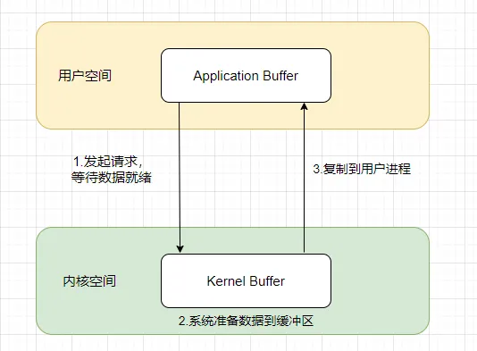
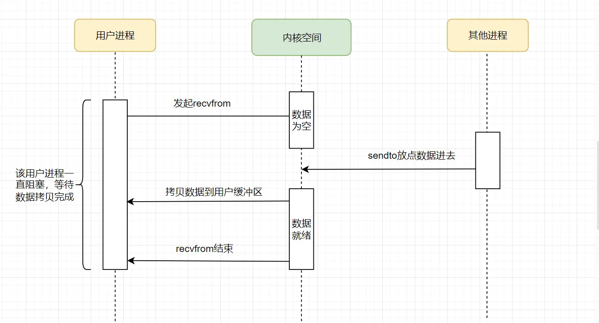
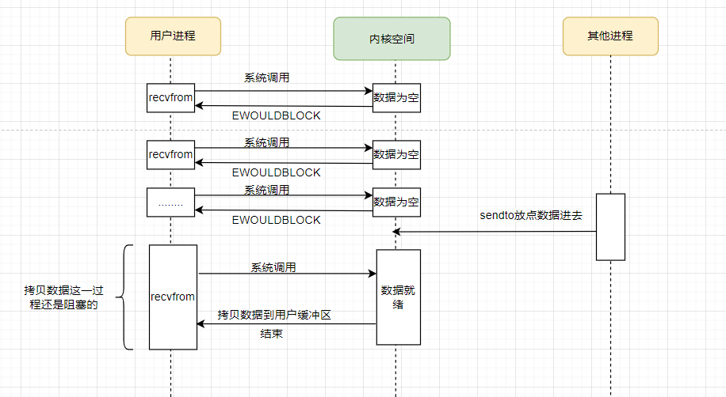
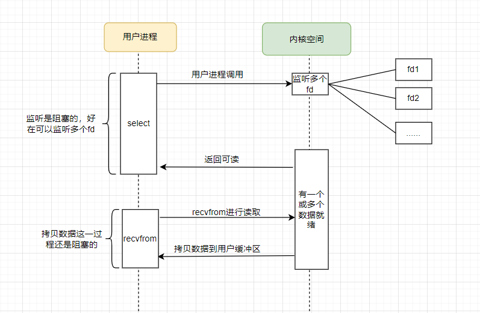
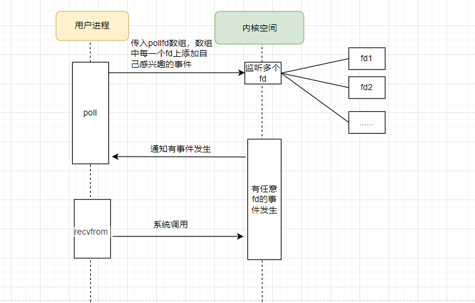
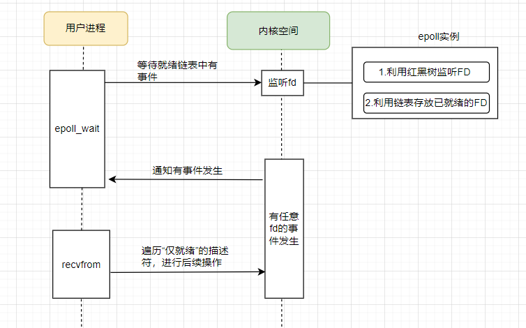
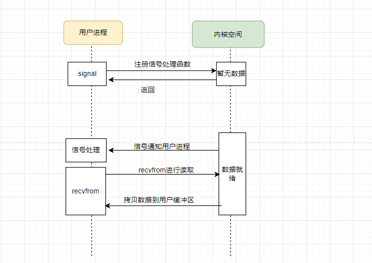
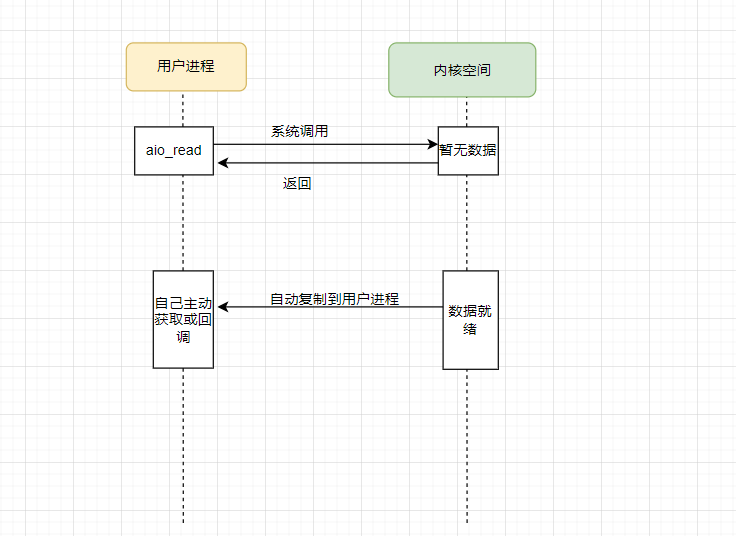

​		我们在讨论网络 I/O 模型时，首先要确定的就是**语境**。很多开发者在谈论网络IO模型容易说不清楚，就是语境不明确。 Java NIO、Netty、 Redis、Nginx等框架都有自己的网络 I/O 模型。不过无论上层框架如何演进，它们都必须构建在操作系统提供的底层机制之上。本文将语境锁定在 **Linux 操作层面**，回归到《UNIX网络编程》中经典的五种 I/O 模型：**阻塞I/O、非阻塞I/O、I/O 多路复用、信号驱动及异步 I/O**。理解了这些 Linux 原生的底层砖石，才能让我们更加理解 Netty、Nginx 等高并发框架的设计灵魂。


# 1.测试环境

**操作系统：** Ubuntu 24.04.2 LTS

**开发软件：** vscode

**gcc版本**：gcc version 13.3.0 

#  2.核心概念：I/O 的两个阶段  



## 第一阶段：等待数据就绪
+ 发生位置： 内核空间
+ 动作： 数据包通过网络链路到达网卡，网卡通过 DMA 方式将数据写入内存，随后内核将数据放入对应的 Socket 接收缓冲区
+ 状态： 此时数据已经在操作系统手里，应用程序还拿不到

## 第二阶段：将数据从内核拷贝到用户进程
+ 发生位置： 从内核空间到用户空间
+ 动作： 操作系统将数据从内核缓冲区 复制 到你在程序中定义的缓冲区
+ 状态： 只有这个阶段完成了，你的业务逻辑才能真正读到这些数据


# 3.阻塞I/O (Blocking I/O)
阻塞IO是最传统的模型，进程发起 recvfrom 调用后，会一直阻塞，直到数据准备好并拷贝到用户空间。

特点是实现简单，但是一个线程只能处理一个连接，并发能力差。

## 第一阶段
用户进程调用recvfrom尝试读取数据，此时无数据尚未到达，内核也在等待数据的到来，用户进程处于阻塞状态。

## 第二阶段
已经有数据到了内核缓冲区，数据已经就绪。内核准备将数据拷贝到用户缓冲区，此时用户进程阻塞直到拷贝完成，用户进程开始处理数据。


**阻塞IO参考代码**

使用recvfrom读取数据

```c
#include <stdio.h>
#include <stdlib.h>
#include <string.h>
#include <sys/socket.h>
#include <netinet/in.h>
#include <unistd.h>

int main() {
    //socket 文件描述符，在 Linux 中，socket 也是一种文件
    int sockfd;
    //用户空间缓冲区，用于接收内核拷贝出来的数据
    char buffer[1024];
    //servaddr：服务器地址结构，cliaddr：客户端地址结构
    struct sockaddr_in servaddr, cliaddr;
    //地址结构体长度
    socklen_t len = sizeof(cliaddr);

    // 1. 创建 Socket,默认情况下，创建的 socket 是阻塞的
    sockfd = socket(AF_INET, SOCK_DGRAM, 0);

    //将结构体清零，避免脏数据
    memset(&servaddr, 0, sizeof(servaddr));
    //指定 IPv4 协议族
    servaddr.sin_family = AF_INET;
    //监听所有网卡地址
    servaddr.sin_addr.s_addr = INADDR_ANY;
    //设置监听端口为 8080
    servaddr.sin_port = htons(8080);

    // 2. 绑定端口
    bind(sockfd, (const struct sockaddr *)&servaddr, sizeof(servaddr));

    printf("进程已进入阻塞状态，等待数据到来...\n");

    /**
     * 3. 调用 recvfrom
     * 【第一阶段】：如果内核缓冲区没有数据，进程会在这里挂起，进入阻塞状态，直到有数据到来。
     * 【第二阶段】：当数据到达内核，内核会将数据拷贝到 buffer 中，拷贝完成后此函数才返回。
     */
    ssize_t n = recvfrom(sockfd, buffer, sizeof(buffer) - 1, 0, 
                         (struct sockaddr *)&cliaddr, &len);

    buffer[n] = '\0'; // 加上字符串结束符
    printf("收到数据: %s\n", buffer);

    //关闭 socket
    close(sockfd);
    return 0;
}
```

使用sendto发送数据

```c
#include <stdio.h>
#include <stdlib.h>
#include <string.h>
#include <sys/socket.h>
#include <netinet/in.h>
#include <arpa/inet.h>
#include <unistd.h>

int main() {
    int sockfd;
    struct sockaddr_in servaddr;
    char *message = "Hello,BIO";

    // 1. 创建 UDP Socket
    sockfd = socket(AF_INET, SOCK_DGRAM, 0);
    // 清空结构体，避免未初始化字段
    memset(&servaddr, 0, sizeof(servaddr));
    servaddr.sin_family = AF_INET;
    servaddr.sin_port = htons(8080);
    //设置目标 IP 地址为本机回环地址
    servaddr.sin_addr.s_addr = inet_addr("127.0.0.1");

    printf("准备发送数据...\n");

    /**
     * 2. 调用 sendto
     * 【第一阶段】：内核检查 Socket 发送缓冲区是否有空间。
     * 【第二阶段】：如果空间足够，内核将数据从用户空间的 message 拷贝到内核发送缓冲区。
     */
    ssize_t n = sendto(sockfd, message, strlen(message), 0,
                       (const struct sockaddr *) &servaddr, sizeof(servaddr));

    if (n < 0) {
        perror("sendto 失败");
    } else {
        printf("成功发送 %zd 字节数据到内核发送缓冲区。\n", n);
    }

    close(sockfd);
    return 0;
}
```


# 4. 非阻塞 I/O (Nonblocking I/O)
非阻塞I/O在进程发起 recvfrom 后，如果内核缓冲区数据没准备好，内核会立即返回一个 EWOULDBLOCK 错误。然后用户进程需要不断轮询（Polling）内核，查询数据是否已经就绪。特点是避免了线程完全挂起，但轮询极其消耗 CPU 资源。

## 第一阶段

用户进程调用recvfrom尝试读取数据，此时内核缓冲区尚无数据，内核返回异常给用户进程，用户进程拿到错误后，再次尝试读取，并一直重复此过程直到数据准备就绪

## 第二阶段

已经有数据到了内核缓冲区，数据已经就绪。内核准备将数据拷贝到用户缓冲区，此时用户进程阻塞直到拷贝完成，用户进程开始处理数据。



**非阻塞IO参考代码**

recvfrom读取数据

```c
#include <stdio.h>
#include <stdlib.h>
#include <string.h>
#include <sys/socket.h>
#include <netinet/in.h>
#include <fcntl.h>
#include <unistd.h>
#include <errno.h>

int main() {
    int sockfd;
    char buffer[1024];
    struct sockaddr_in servaddr, cliaddr;
    socklen_t len = sizeof(cliaddr);

    // 1. 创建 Socket
    sockfd = socket(AF_INET, SOCK_DGRAM, 0);

    // --------------------------------------------------------
    // 【关键步骤】：设置 Socket 为非阻塞模式
    // --------------------------------------------------------
    int flags = fcntl(sockfd, F_GETFL, 0);
    fcntl(sockfd, F_SETFL, flags | O_NONBLOCK);

    memset(&servaddr, 0, sizeof(servaddr));
    servaddr.sin_family = AF_INET;
    servaddr.sin_addr.s_addr = INADDR_ANY;
    servaddr.sin_port = htons(8080);

    bind(sockfd, (const struct sockaddr *)&servaddr, sizeof(servaddr));

    printf("开始非阻塞轮询（Polling）...\n");

    while (1) {
        /**
         * 2. 调用 recvfrom
         * 【第一阶段】：内核发现没数据，由于设置了非阻塞，它不会挂起进程，
         * 而是立刻返回 -1，并将 errno 设为 EWOULDBLOCK。
         */
        ssize_t n = recvfrom(sockfd, buffer, sizeof(buffer) - 1, 0, 
                             (struct sockaddr *)&cliaddr, &len);

        if (n > 0) {
            // 【第二阶段】：数据就绪并拷贝完成
            buffer[n] = '\0';
            printf("成功获取数据: %s\n", buffer);
            break; 
        } else if (n < 0 && (errno == EWOULDBLOCK || errno == EAGAIN)) {
            // 数据未就绪，进程可以去干点别的
            printf("内核数据未就绪，我先去处理别的事...\n");
            sleep(1); // 模拟处理其他业务
            continue;
        } else {
            perror("recvfrom 出错");
            break;
        }
    }

    close(sockfd);
    return 0;
}
```

sendto发送数据

```c
#include <stdio.h>
#include <string.h>
#include <sys/socket.h>
#include <netinet/in.h>
#include <arpa/inet.h>
#include <fcntl.h>
#include <unistd.h>
#include <errno.h>

int main() {
    int sockfd;
    struct sockaddr_in servaddr;
    char *message = "Hello";

    sockfd = socket(AF_INET, SOCK_DGRAM, 0);

    // 将 Socket 设置为非阻塞
    int flags = fcntl(sockfd, F_GETFL, 0);
    fcntl(sockfd, F_SETFL, flags | O_NONBLOCK);

    memset(&servaddr, 0, sizeof(servaddr));
    servaddr.sin_family = AF_INET;
    servaddr.sin_port = htons(8080);
    servaddr.sin_addr.s_addr = inet_addr("127.0.0.1");

    /**
     * 调用 sendto
     * 在非阻塞模式下：
     * 1. 如果内核发送缓冲区有空间，数据立即从用户态拷贝到内核态，函数返回发送字节数。
     * 2. 如果缓冲区瞬间满了，函数立即返回 -1，errno 被设为 EWOULDBLOCK。
     */
    ssize_t n = sendto(sockfd, message, strlen(message), 0,
                       (const struct sockaddr *) &servaddr, sizeof(servaddr));

    if (n >= 0) {
        printf("数据已成功拷贝至内核缓冲区，发送了 %zd 字节。\n", n);
    } else {
        if (errno == EWOULDBLOCK || errno == EAGAIN) {
            printf("发送缓冲区暂满，请稍后重试。\n");
        } else {
            perror("发送出错");
        }
    }

    close(sockfd);
    return 0;
}
```

# 5. I/O 多路复用 (I/O Multiplexing)

用一句话概括就是一个线程 / 进程，同时监听多个文件描述符（fd），哪个就绪就处理哪个。

I/O 多路复用的本质并不是让 I/O 变快，而是让单个线程能够处理更多的连接，以较小的代价同时处理成千上万个连接。虽然它在两个阶段中都有阻塞，但它通过‘一次等待、多个机会’的方式，极大地提高了服务器的并发处理能力。这也是 Netty 等高性能框架的基础。

**I/O 多路复用**在Linux上实现的方式有**select、poll 和 epoll**。下面分情况说明：

## select

在 Linux 系统中，select 是最早的 I/O 多路复用系统调用。它的核心思想是：与其让你的进程反复去轮询每个 Socket（非阻塞 I/O 的做法），不如把这一堆 Socket 丢给 select，让它代为监听。

### 第一阶段

用户进程调用select并指定要监听的fd集合，也就是多个socket。任意一个或多个socket数据就绪返回可读。在这一阶段用户进程阻塞。

### 第二阶段

当 select 返回时，表示已有 socket 的数据准备就绪。用户进程随后循环定位到这些就绪的 socket，并依次调用 recvfrom 读取数据，把数据从内核拷贝至用户进程



**select参考代码**

```c
#include <stdio.h>
#include <sys/types.h>
#include <sys/socket.h>
#include <netinet/in.h>
#include <sys/select.h>
#include <unistd.h>
#include <string.h>

int main() {
    int sockfd;
    struct sockaddr_in servaddr;
    char buffer[1024];

    // 1. 准备网络 Socket
    sockfd = socket(AF_INET, SOCK_DGRAM, 0);
    memset(&servaddr, 0, sizeof(servaddr));
    servaddr.sin_family = AF_INET;
    servaddr.sin_addr.s_addr = INADDR_ANY;
    servaddr.sin_port = htons(8080);
    bind(sockfd, (const struct sockaddr *)&servaddr, sizeof(servaddr));

    // 2. 准备 fd_set 集合 
    fd_set readfds;
    int maxfd = (sockfd > STDIN_FILENO) ? sockfd : STDIN_FILENO;

    printf("select 正在监听键盘输入和网络数据(8080端口)...\n");

    while (1) {
        // 每次调用 select 都要重新初始化 fd_set
        FD_ZERO(&readfds);
        FD_SET(STDIN_FILENO, &readfds); // 监听键盘
        FD_SET(sockfd, &readfds);       // 监听网络

        /**
         * 3. 调用 select (这步是阻塞的)
         * 【第一阶段】：进程阻塞在 select 调用上，等待“任一”文件描述符就绪。
         */
        int activity = select(maxfd + 1, &readfds, NULL, NULL, NULL);

        if (activity < 0) {
            perror("select 出错");
            break;
        }

        // 4. 判断是谁就绪了
        if (FD_ISSET(sockfd, &readfds)) {
            /**
             * 【第二阶段】：内核通知数据到了，进程调用 recvfrom。
             * 此时数据从内核拷贝到用户空间。
             */
            ssize_t n = recvfrom(sockfd, buffer, sizeof(buffer)-1, 0, NULL, NULL);
            buffer[n] = '\0';
            printf("网络消息: %s\n", buffer);
        }

        if (FD_ISSET(STDIN_FILENO, &readfds)) {
            fgets(buffer, sizeof(buffer), stdin);
            printf("键盘输入: %s", buffer);
        }
    }

    close(sockfd);
    return 0;
}
```

## poll 

poll 是 select 的改进版 IO 多路复用模型。相比之下主要有如下改进：

1. 没有 1024 的硬限制：select 受到 FD_SETSIZE 的位图大小限制（默认 1024），而 poll 传入的是数组指针，只要内存够，监听 1 万个、10 万个都没问题。
2. 输入输出分离：select 每次调用都要重置 fd_set，因为内核会直接修改它，所以要自己把fd_set修改正确。而 poll 把“感兴趣的事件” (events) 和“实际发生的事件” (revents) 分开了，这样你就不需要在循环里不停地重新初始化数组。

### 第一阶段

用户进程调用 poll，并传入一个 pollfd 数组，数组中包含多个需要监听的文件描述符及其关注的事件类型（如可读、可写等）。
 poll 会在内核中检查这些文件描述符的状态，只要任意一个或多个 fd 变为就绪，poll 即返回。在这一阶段，如果没有任何 fd 就绪，用户进程将被阻塞（或在超时后返回）。

### 第二阶段

文件描述符发生了用户所关心的事件,用户进程随后遍历 pollfd 数组，通过检查每个元素的 revents 字段定位到就绪的 fd，并依次对fd调用 read / recvfrom / write 等系统调用进行实际的 IO 操作，内核再将数据从内核态拷贝到用户进程。



**poll参考代码**

```c
#include <stdio.h>
#include <stdlib.h>
#include <string.h>
#include <poll.h>
#include <sys/socket.h>
#include <netinet/in.h>
#include <unistd.h>
#include <fcntl.h>

int main() {
    // --- 准备工作：创建两个测试用的 Socket ---
    int sockfd = socket(AF_INET, SOCK_DGRAM, 0); // 监听 8080
    int client_fd = socket(AF_INET, SOCK_DGRAM, 0); // 监听 9090 
    
    struct sockaddr_in addr1, addr2;
    // 绑定 8080
    addr1.sin_family = AF_INET; addr1.sin_port = htons(8080); addr1.sin_addr.s_addr = INADDR_ANY;
    bind(sockfd, (struct sockaddr *)&addr1, sizeof(addr1));
    // 绑定 9090
    addr2.sin_family = AF_INET; addr2.sin_port = htons(9090); addr2.sin_addr.s_addr = INADDR_ANY;
    bind(client_fd, (struct sockaddr *)&addr2, sizeof(addr2));

    // --- 核心逻辑开始 ---

    // 1. 定义一个 pollfd 数组，体现“多路”
    struct pollfd fds[3]; 

    // 第一个 fd：网络 Socket (监听读)
    fds[0].fd = sockfd;
    //【输入参数】我感兴趣的事件 (如 POLLIN | POLLOUT)
    fds[0].events = POLLIN;

    // 第二个 fd：键盘输入 (监听读)
    fds[1].fd = STDIN_FILENO;
    fds[1].events = POLLIN;

    // 第三个 fd：另一个客户端连接 (同时监听读和写)
    fds[2].fd = client_fd;
    fds[2].events = POLLIN | POLLOUT; 

    printf("Poll 正在同时监听：[8080端口] [键盘输入] [9090端口读写]...\n");

    while (1) {
        // 2. 一次性把整个数组丢给内核（第一阶段：阻塞等待）
        int ret = poll(fds, 3, -1); 

        if (ret < 0) { perror("poll 出错"); break; }

        // 3. 遍历数组，找到是谁就绪了（第二阶段：数据拷贝与处理）
        for (int i = 0; i < 3; i++) {
            //【输出参数】内核实际发生的事件 (内核填写的)
            if (fds[i].revents & POLLIN) { // 如果是读就绪
                char buf[1024];
                if (fds[i].fd == STDIN_FILENO) {
                    fgets(buf, sizeof(buf), stdin);
                    printf(">>> 触发键盘输入: %s", buf);
                } else {
                    ssize_t n = recvfrom(fds[i].fd, buf, sizeof(buf)-1, 0, NULL, NULL);
                    buf[n] = '\0';
                    printf(">>> 触发 Socket(%d) 接收: %s\n", fds[i].fd, buf);
                }
            }
            
            if (fds[i].revents & POLLOUT) { // 如果是写就绪
                // 仅在 client_fd 需要写且缓冲区有空位时触发
                if (fds[i].fd == client_fd) {
                    //TODO
                }
            }
        }
    }

    close(sockfd); close(client_fd);
    return 0;
}
```

## epoll

epoll相比于select / poll，它不需要遍历全部 fd, 只返回真正就绪的 fd,  fd 的注册与事件等待解耦

### 第一阶段

用户进程首先通过 epoll_create 创建一个 epoll 实例，并使用 epoll_ctl 将需要监听的多个文件描述符注册到 epoll 中，同时指定关心的事件类型（如可读、可写等）。
 当用户进程调用 epoll_wait 时，如果没有已就绪的文件描述符，进程将被阻塞；一旦任意一个或多个已注册的 fd 发生了用户关心的事件，epoll_wait 立即返回。

------

### 第二阶段

当 epoll_wait 返回时，表示已有文件描述符处于就绪状态。 用户进程可以直接从 epoll_wait 返回的事件数组中获取所有就绪的 fd，并依次对这些 fd 调用 recvfrom 等系统调用完成实际的 IO 操作，内核再将数据从内核态拷贝到用户进程。



**epoll参考代码**

```c
#include <stdio.h>
#include <stdlib.h>
#include <string.h>
#include <sys/epoll.h>
#include <sys/socket.h>
#include <netinet/in.h>
#include <unistd.h>

#define MAX_EVENTS 5

int main() {
    // 1. 准备网络 Socket
    int listen_sock = socket(AF_INET, SOCK_DGRAM, 0);
    struct sockaddr_in addr;
    addr.sin_family = AF_INET; addr.sin_port = htons(8080); addr.sin_addr.s_addr = INADDR_ANY;
    bind(listen_sock, (struct sockaddr *)&addr, sizeof(addr));

    // 2. 创建 epoll 实例 (内核红黑树的开端)
    int epfd = epoll_create1(0);
    if (epfd == -1) { perror("epoll_create1"); exit(EXIT_FAILURE); }

    struct epoll_event ev, events[MAX_EVENTS];

    // 3. 注册【网络 Socket】到 epoll
    ev.events = EPOLLIN;     // 监听读就绪, 
    ev.data.fd = listen_sock; 
    epoll_ctl(epfd, EPOLL_CTL_ADD, listen_sock, &ev);

    // 4. 注册【标准输入/键盘】到 epoll
    ev.events = EPOLLIN;
    ev.data.fd = STDIN_FILENO; // 文件描述符 0
    epoll_ctl(epfd, EPOLL_CTL_ADD, STDIN_FILENO, &ev);

    printf("epoll 正在同时监听 [8080端口] 和 [键盘输入]...\n");

    while (1) {
        // 5. 等待就绪链表中有事件 (第一阶段)
        int nfds = epoll_wait(epfd, events, MAX_EVENTS, -1);

        // 6. 遍历“仅就绪”的描述符 (第二阶段)
        for (int i = 0; i < nfds; ++i) {
            if (events[i].data.fd == listen_sock) {
                // 处理网络数据
                char buf[1024];
                ssize_t n = recvfrom(listen_sock, buf, sizeof(buf)-1, 0, NULL, NULL);
                if (n > 0) {
                    buf[n] = '\0';
                    printf(">>> 网络消息: %s\n", buf);
                }
            } 
            else if (events[i].data.fd == STDIN_FILENO) {
                // 处理键盘输入
                char buf[1024];
                if (fgets(buf, sizeof(buf), stdin) != NULL) {
                    printf(">>> 键盘输入: %s", buf);
                }
            }
        }
    }

    close(listen_sock);
    close(epfd);
    return 0;
}
```


###  epoll中的两种触发模式

在epoll中在数据就绪时，有两种不同的触发模式，分别是：

 **1. LT (Level Triggered，水平触发)** 

 **2.ET (Edge Triggered，边缘触发)**

它是在调用 **`epoll_ctl`** 注册或修改文件描述符（fd）的事件时，通过 `events` 结构体成员指定的。

```c
struct epoll_event ev;

// --- 设定为 ET (边缘触发) ---
ev.events = EPOLLIN | EPOLLET; // 监听读事件，并开启 ET 模式
ev.data.fd = sockfd;
epoll_ctl(epfd, EPOLL_CTL_ADD, sockfd, &ev);

// --- 设定为 LT (水平触发) ---
ev.events = EPOLLIN;           // 默认就是 LT
ev.data.fd = sockfd;
epoll_ctl(epfd, EPOLL_CTL_ADD, sockfd, &ev);
```

| **触发模式**      | **内核提醒时机**                                             | **编程复杂度**             | **性能 / 并发**                  |
| ----------------- | ------------------------------------------------------------ | -------------------------- | -------------------------------- |
| **LT (水平触发)** | **只要**缓冲区里有数据，`epoll_wait` 每次都会返回该 fd。因为可能数量太大一次没读完会反复提醒 | 低（像 `select/poll`）     | 较低（频繁提醒导致系统调用增多） |
| **ET (边缘触发)** | **只有**数据从无到有，或者增加时，`epoll_wait` 才会提醒一次。并在事件触发后一次性处理完所有数据，否则容易丢事件。 | 高（必须循环读完所有数据） | 高（减少了内核态与用户态切换）   |


# 6. 信号驱动 I/O (Signal Driven I/O)
进程告知内核：当描述符就绪时，请给我发一个 SIGIO 信号。进程在等待时不阻塞。

但是在 TCP 中很少使用，因为 SIGIO 信号产生得太频繁（如连接建立、断开、数据到达等都会触发），难以区分。而且用户进程和内核频繁信号交互性能也较低。

## 第一阶段

用户进程通过 sigaction 注册 SIGIO 信号处理函数，并使用 fcntl 将文件描述符设置为信号驱动模式，内核完成注册后开始监听对应的文件描述符。用户进程不阻塞等待，可以执行其他逻辑，当文件描述符上的数据在内核中准备就绪时，内核向用户进程发送 SIGIO 信号，触发用户注册的信号处理函数

## 第二阶段

用户进程接收到 SIGIO 信号回调，在信号处理函数中，或在信号处理完成后，调用 recvfrom / read 等系统调用读取数据，内核将就绪的数据从内核空间拷贝到用户进程的用户空间缓冲区，用户进程对读取到的数据进行业务处理，完成一次 I/O 操作



**信号驱动 I/O参考代码**

```c
#define _GNU_SOURCE  // 开启 GNU/Linux 特有扩展
#include <stdio.h>
#include <fcntl.h> 
#include <unistd.h>
#include <signal.h>
#include <stdio.h>
#include <stdlib.h>
#include <string.h>
#include <unistd.h>
#include <fcntl.h>
#include <signal.h>
#include <sys/socket.h>
#include <netinet/in.h>
#include <errno.h>
#include <sys/types.h>
 
int sockfd;

// 1. 信号处理函数：当内核发现数据就绪时，会异步调用此函数
void sigio_handler(int sig) {
    char buf[1024];
    struct sockaddr_in cliaddr;
    socklen_t len = sizeof(cliaddr);

    /**
     * 【第二阶段】：数据拷贝
     * 信号触发说明第一阶段（等待）完成了。
     * 但我们仍需手动调用 recvfrom 将数据从内核拷贝到用户空间。
     */
    ssize_t n = recvfrom(sockfd, buf, sizeof(buf)-1, 0, (struct sockaddr *)&cliaddr, &len);
    if (n > 0) {
        buf[n] = '\0';
        printf("\n[信号通知] 收到数据: %s\n", buf);
    }
}

int main() {
    struct sockaddr_in servaddr;

    sockfd = socket(AF_INET, SOCK_DGRAM, 0);

    // 2. 绑定地址
    memset(&servaddr, 0, sizeof(servaddr));
    servaddr.sin_family = AF_INET;
    servaddr.sin_port = htons(8080);
    servaddr.sin_addr.s_addr = INADDR_ANY;
    bind(sockfd, (const struct sockaddr *)&servaddr, sizeof(servaddr));

    // 3. 注册信号处理函数
    signal(SIGIO, sigio_handler);

    // 4. 【关键】设置 Socket 属主：告诉内核 SIGIO 信号发给当前进程
    fcntl(sockfd, F_SETOWN, getpid());

    // 5. 【关键】开启信号驱动 I/O 模式
    int flags = fcntl(sockfd, F_GETFL, 0);
    fcntl(sockfd, F_SETFL, flags | O_ASYNC | O_NONBLOCK);

    printf("信号驱动 I/O 已就绪，进程正在执行其他任务...\n");

    // 模拟进程在干别的事情
    while (1) {
        printf(".");
        fflush(stdout);
        sleep(1); 
    }

    close(sockfd);
    return 0;
}
```

**发送数据**

```c
#include <stdio.h>
#include <stdlib.h>
#include <string.h>
#include <unistd.h>
#include <arpa/inet.h>
#include <sys/socket.h>

int main() {
    int sockfd;
    struct sockaddr_in servaddr;
    char *message = "Hello from Client! This is a Signal Trigger.";

    // 1. 创建 UDP Socket
    if ((sockfd = socket(AF_INET, SOCK_DGRAM, 0)) < 0) {
        perror("socket creation failed");
        exit(EXIT_FAILURE);
    }

    memset(&servaddr, 0, sizeof(servaddr));

    // 2. 填充服务器信息 (8080 端口)
    servaddr.sin_family = AF_INET;
    servaddr.sin_port = htons(8080);
    servaddr.sin_addr.s_addr = inet_addr("127.0.0.1");

    // 3. 发送数据
    int n = sendto(sockfd, (const char *)message, strlen(message),
        0, (const struct sockaddr *) &servaddr, sizeof(servaddr));
    
    if (n < 0) {
        perror("sendto failed");
    } else {
        printf("成功向 8080 端口发送了 %d 字节数据。\n", n);
        printf("内容: %s\n", message);
    }

    close(sockfd);
    return 0;
}
```


# 7. 异步 I/O (Asynchronous IO)
真正的异步模型。进程发起 aio_read 后直接返回，去干别的事。内核会自动完成“等待数据”和“拷贝数据”两个阶段，完成后再通知进程。

AIO效率最高，但 Linux 现有的 AIO 实现并不完美（主要针对文件 I/O，网络 I/O 仍以 epoll 为主）。AIO 没有传统IO的两个阶段。它把传统 I/O 模型中的两个阶段合并成一个完全异步的阶段。



**异步 I/O参考代码**

```c
#define _GNU_SOURCE
#include <stdio.h>
#include <stdlib.h>
#include <string.h>
#include <fcntl.h>
#include <aio.h>
#include <unistd.h>
#include <signal.h>

#define BUF_SIZE 1024

// 1. 定义回调函数
// 当异步读取完成后，内核会自动在一个新线程中调用此函数
void my_aio_completion_handler(union sigval sv) {
    // 通过 sv.sival_ptr 找回我们提交的任务控制块 aiocb
    struct aiocb *cbp = (struct aiocb *)sv.sival_ptr;

    // 检查任务是否真的成功完成
    if (aio_error(cbp) == 0) {
        // 【关键】调用 aio_return 结算结果（获取读取的字节数）
        ssize_t n = aio_return(cbp);
        
        printf("\n[回调线程通知] 异步读取完成！\n");
        printf("内容: %.*s\n", (int)n, (char *)cbp->aio_buf);
        printf("读取字节数: %ld\n", n);
    } else {
        perror("aio_error");
    }

    // 任务结束后关闭文件描述符
    close(cbp->aio_fildes);
    printf("回调处理完毕，子线程退出。\n");
}

int main() {
    int fd = open("test.txt", O_RDONLY);
    if (fd < 0) {
        perror("请先创建一个名为 test.txt 的文件");
        return 1;
    }

    // 2. 准备 aiocb 结构体
    struct aiocb cb;
    char buffer[BUF_SIZE];
    memset(&cb, 0, sizeof(struct aiocb));

    cb.aio_fildes = fd;
    cb.aio_buf = buffer;
    cb.aio_nbytes = BUF_SIZE;
    cb.aio_offset = 0;

    // 3. 设置回调机制 (SIGEV_THREAD)
    cb.aio_sigevent.sigev_notify = SIGEV_THREAD;            // 通知方式：启动线程
    cb.aio_sigevent.sigev_notify_function = my_aio_completion_handler; // 指定函数
    cb.aio_sigevent.sigev_notify_attributes = NULL;         // 使用默认线程属性
    cb.aio_sigevent.sigev_value.sival_ptr = &cb;            // 传递给回调函数的参数

    // 4. 发起异步读取
    if (aio_read(&cb) == -1) {
        perror("aio_read");
        close(fd);
        return 1;
    }

    printf("主线程：读取请求已提交，我现在要去忙别的事了...\n");

    // 5. 模拟主线程繁忙，证明它没有被卡住
    for (int i = 0; i < 5; i++) {
        printf("主线程：正在处理业务逻辑 %d...\n", i);
        sleep(1);
    }

    printf("主线程：所有工作完成，程序即将退出。\n");
    // 给回调线程留一点运行时间
    sleep(1); 

    return 0;
}
```

# 8.总结对比

最后总结对比一下各个IO模型

| **<font style="color:rgb(31, 31, 31);">模型</font>**         | **<font style="color:rgb(31, 31, 31);">阶段 1 (等待就绪)</font>** | **<font style="color:rgb(31, 31, 31);">阶段 2 (数据拷贝)</font>** | **<font style="color:rgb(31, 31, 31);">是否异步</font>** |
| ------------------------------------------------------------ | ------------------------------------------------------------ | ------------------------------------------------------------ | -------------------------------------------------------- |
| **<font style="color:rgb(31, 31, 31);">阻塞 I/O</font>**     | <font style="color:rgb(31, 31, 31);">阻塞</font>             | <font style="color:rgb(31, 31, 31);">阻塞</font>             | <font style="color:rgb(31, 31, 31);">同步</font>         |
| **<font style="color:rgb(31, 31, 31);">非阻塞 I/O</font>**   | <font style="color:rgb(31, 31, 31);">轮询</font>             | <font style="color:rgb(31, 31, 31);">阻塞</font>             | <font style="color:rgb(31, 31, 31);">同步</font>         |
| **<font style="color:rgb(31, 31, 31);">I/O 多路复用</font>** | 阻塞 (在 select/poll/epoll 上)                               | <font style="color:rgb(31, 31, 31);">阻塞</font>             | <font style="color:rgb(31, 31, 31);">同步</font>         |
| **<font style="color:rgb(31, 31, 31);">信号驱动 I/O</font>** | 异步 (信号通知)                                              | <font style="color:rgb(31, 31, 31);">阻塞</font>             | <font style="color:rgb(31, 31, 31);">同步</font>         |
| **<font style="color:rgb(31, 31, 31);">异步 I/O (AIO)</font>** | 异步                                                         | <font style="color:rgb(31, 31, 31);">异步</font>             | 真正异步                                                 |


# 9.网络框架设计模式

我们常见的**Reactor**模式和**Proactor**模式是两种常见的网络框架设计模式

## Reactor模式

Reactor 是「被动式 I/O」，应用是被“事件”推动的。被动的等待内核通知可读/可写，再进行对应的读写操作。由内核通知应用程序可以干活了（应用程序还得自己动手）

## Proactor模式

Proactor 是「主动式 I/O」， 应用主动发起 I/O 行为，I/O 在后台完成。内核通知你活已经干完了（应用程序直接拿结果）。

## 两种模式对比


| **特性**            | **Reactor (同步)**                    | **Proactor (异步)**                   |
| ------------------- | ------------------------------------- | ------------------------------------- |
| **谁做 read/write** | 应用程序                              | 操作系统                              |
| **通知时机**        | **数据已就绪** (可以读了)             | **操作已完成** (已经读完了)           |
| **数据搬运**        | 阻塞拷贝 (Kernel -> Application)      | 异步拷贝 (无需等待)                   |
| **系统支持**        | Linux (select,poll,epoll), Java (NIO) | Windows (IOCP), Linux (AIO，io_uring) |
| **编程复杂度**      | 中                                    | 高                                    |